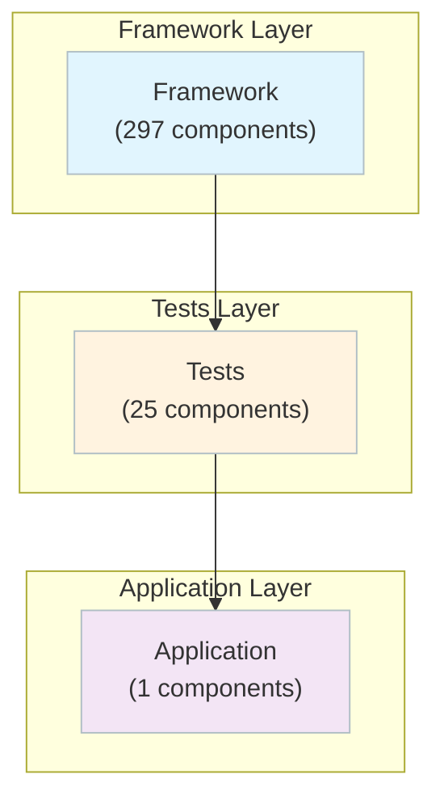

# CodeIgniter 4 - Complete C4 Architecture Documentation
**Generated by Flowscribe**  
**Date:** 2025-10-15  
**Analysis Cost:** $0.224  
**Total Components (Deptrac):** 323  
**L4 Component Docs:** 12  
**Architecture Grade:** C+

---

## 📋 Table of Contents

1. [Quick Start](#quick-start)
2. [Documentation Levels](#documentation-levels)
3. [Architecture Overview](#architecture-overview)
4. [C4 Level 1: System Context](#c4-level-1-system-context)
5. [C4 Level 2: Containers](#c4-level-2-containers)
6. [C4 Level 3: Components](#c4-level-3-components)
7. [C4 Level 4: Code](#c4-level-4-code)
8. [Architecture Review](#architecture-review)
9. [Key Insights](#key-insights)
10. [Refactoring Priorities](#refactoring-priorities)
11. [How to Use This Documentation](#how-to-use-this-documentation)

---

## Quick Start

**Path 1: High-Level Overview (5 minutes)**
1. 📊 [C4 Level 1: System Context](./c4-level1.md) - Who uses it, what it connects to
2. 🗄️ [C4 Level 2: Containers](./c4-level2.md) - Major architectural layers
3. ⚡ Key insights below

**Path 2: Architecture Deep Dive (30 minutes)**
1. Start with Path 1 above
2. 🔍 [C4 Level 3: Components](#c4-level-3-components) - Pick a layer to explore
3. 💡 [C4 Level 4: Code Hub](./c4-level4.md) - Understand key components
4. 📋 [Architecture Review](./architecture-review.md) - Expert assessment and recommendations

**Path 3: Component-Focused**
1. 📚 [C4 Level 4: Code Hub](./c4-level4.md)
2. 🔬 Dive into specific component documentation
3. 🔄 Trace back to L3 and L2 for context

---

## Documentation Levels

| Level | Document | What It Shows | Audience | Status |
|------:|----------|---------------|----------|--------|
| **L1** | [System Context](./c4-level1.md) | Boundaries, users, externals | Everyone | ✅ |
| **L2** | [Containers](./c4-level2.md) | High-level architecture | Architects/Leads | ✅ |
| **L3** | [Components](#c4-level-3-components) | Components by layer | Devs/Architects | ✅ |
| **L4** | [Code](./c4-level4.md) | Code-level design | Sr Devs/Architects | ✅ |
| **Review** | [Architecture Review](./architecture-review.md) | Assessment + roadmap | Architects/Leads | ✅ |

---

## Architecture Overview

**Key Statistics**
- **Architectural Layers:** 3
- **Total Components (Deptrac):** 323
- **L4 Component Docs:** 12
- **Architectural Violations:** 8616
- **Architecture Grade:** C+
- **Analysis Cost:** $0.224
- **Analysis Tokens:** 152,449

### Rich Layered Overview

### Layers
- **Framework:** 297 components
- **Tests:** 25 components
- **Application:** 1 components

### Layer Documentation
- **Application:** ✅ [L3 Documentation →](./c4-level3-application.md) — 1 components
- **Framework:** ✅ [L3 Documentation →](./c4-level3-framework.md) — 297 components

---

## C4 Level 1: System Context
📄 **[Open L1 →](./c4-level1.md)** ✅

## C4 Level 2: Containers
📄 **[Open L2 →](./c4-level2.md)** ✅

## C4 Level 3: Components
_See layer links above_

## C4 Level 4: Code
📄 **[Open L4 Hub →](./c4-level4.md)** ✅

---

## Architecture Review
📋 **[Open Review →](./architecture-review.md)** ✅

### Executive Summary
CodeIgniter 4 represents a significant evolution of the PHP framework, introducing modern patterns and PSR compliance while maintaining its "lightweight and simple" philosophy. However, the architecture suffers from fundamental layering violations and organizational inconsistencies that undermine maintainability and testability. With 8,616 architectural violations—primarily from the Framework layer inappropriately depending on Application and Tests layers—the codebase exhibits classic symptoms of architectural erosion where convenience has trumped proper separation of concerns.

The framework demonstrates strong technical capabilities in individual components (query building, routing, email handling) but lacks the disciplined layer boundaries essential for a mature, enterprise-grade framework. The most critical issue is the bidirectional dependency between Framework and Application layers (7,466 violations), which fundamentally breaks the dependency inversion principle and creates tight coupling that will impede future evolution.

Despite these concerns, CodeIgniter 4's comprehensive feature set, active development practices (evidenced by extensive testing infrastructure), and commitment to modern PHP standards provide a solid foundation for improvement. The path forward requires aggressive refactoring to establish proper architectural boundaries, not incremental tweaks.

**Grade:** C+

---

## Analysis Metrics

**Total Cost:** $0.2235  
**Total Tokens:** 152,449  
**Total Time:** 389.5s (6.5 minutes)

## 📊 Cost & Usage Summary

| Stage | Model | Cost (USD) | Tokens (in/out) | Duration (s) |
|-------|-------|-----------:|----------------:|-------------:|
| 🧭 C4 Level 1 - Context | x-ai/grok-code-fast-1 | $0.0020 | 1,924 / 1,123 | 11.2 |
| 🏗️ C4 Level 2 - Containers | none | $0.0000 | 0 / 0 | 0.1 |
| ⚙️ C4 Level 4 - Code | x-ai/grok-code-fast-1 | $0.0546 | 89,825 / 24,747 | 213.6 |
| 🧱 Architecture Review | anthropic/claude-sonnet-4.5 | $0.1669 | 29,632 / 5,198 | 107.8 |
| 💼 **TOTAL** |  | **$0.2235** | **121,381 / 31,068** | **332.8** |

_Legend: **in** = prompt tokens, **out** = completion tokens. All costs are from OpenRouter usage accounting._

_Note: No L3 analysis run for this repo._

_Footnote: Total time (389.5s) includes non-LLM overhead (e.g., parsing, IO, prompt build). Per-stage durations sum to 332.8s; delta +56.7s._

---

## Files
- `README.md` (this index)
- `c4-level1.md`, `c4-level2.md`, `c4-level4.md`, `architecture-review.md`
- `c4-level3-*.md` (per-layer components)
- `.c4-level*-metrics.json`, `.architecture-review-metrics.json`, `.flowscribe-metrics.json`

**Last Updated:** 2025-10-15 05:13:26
