# CodeIgniter 4 - C4 Level 1: System Context

**Generated:** 2025-10-15 05:06:37  
**Domain:** web development  
**Diagram Level:** C4 Level 1 (System Context)

---

## System Overview

### Description
CodeIgniter 4 is an open-source PHP framework designed for rapid web application development. It provides a lightweight, MVC-based structure with built-in tools for handling HTTP requests, database interactions, and security. The framework supports extensibility through plugins and integration with various PHP extensions and third-party libraries.

### Purpose
To offer a simple and powerful toolkit for developers to build dynamic web applications efficiently in PHP.

### Key Features
- MVC Architecture
- HTTP Request Handling and Routing
- Database Abstraction Layer
- Caching Mechanisms
- Built-in Security Features (e.g., XSS Protection)
- Command Line Interface (CLI) Tools
- Testing and Static Analysis Support

---

## Users and Actors

### Web Application Developers

**Role:** Developers who use CodeIgniter 4 to create, maintain, and deploy web applications by leveraging its MVC architecture, routing, and built-in features.

**Primary Actions:**
- Build web applications
- Integrate with databases
- Configure caching and security
- Run tests and static analysis

---

## External Systems and Integrations

### PHP Runtime and Extensions

**Purpose:** Provides the core execution environment and necessary extensions for CodeIgniter's functionality, such as internationalization, string handling, and encryption.

**Integration Type:** PHP Interpreter/Extensions

**Data Flow:** Loads extensions like intl, mbstring, and sodium for runtime features; exchanges data via HTTP requests and responses.

### Database Management Systems

**Purpose:** Enables CodeIgniter to interact with various databases for data persistence and querying in web applications.

**Integration Type:** Database Drivers

**Data Flow:** Queries, insertions, and updates to databases like MySQL, PostgreSQL, SQLite, Oracle, or SQL Server; receives data results for application logic.

### Caching Systems

**Purpose:** Improves application performance by storing and retrieving frequently accessed data.

**Integration Type:** API/Handler Classes

**Data Flow:** Stores and retrieves cached data using Redis, Memcached, or similar handlers; handles session data or query results.

### PSR-Compliant Logging Libraries

**Purpose:** Facilitates structured logging for debugging, monitoring, and error tracking in applications.

**Integration Type:** PSR-3 Interface

**Data Flow:** Log messages (e.g., errors, debug info) are sent to external loggers; no direct data exchange beyond log entries.

### Third-Party Libraries (e.g., Laminas Escaper, Faker)

**Purpose:** Enhances functionality like HTML escaping for security and generates fake data for testing.

**Integration Type:** Composer Packages

**Data Flow:** Uses libraries for escaping outputs, generating test data, or image processing; data flows include input sanitization and test fixtures.

---

## System Context Diagram

```mermaid
graph TB
    User[👤 Users<br/>Various user types]
    System["🏛️ CodeIgniter 4<br/>To offer a simple and powerful toolkit for developers to build dynamic web applications efficiently in PHP."]
    Ext0["🔗 PHP Runtime and Extensions<br/>Provides the core execution environment and necessary extensions for CodeIgniter's functionality, such as internationalization, string handling, and encryption."]
    Ext1["🔗 Database Management Systems<br/>Enables CodeIgniter to interact with various databases for data persistence and querying in web applications."]
    Ext2["🔗 Caching Systems<br/>Improves application performance by storing and retrieving frequently accessed data."]
    Ext3["🔗 PSR-Compliant Logging Libraries<br/>Facilitates structured logging for debugging, monitoring, and error tracking in applications."]
    Ext4["🔗 Third-Party Libraries (e.g., Laminas Escaper, Faker)<br/>Enhances functionality like HTML escaping for security and generates fake data for testing."]
    User -->|Uses| System
    System -->|PHP Interpreter/Extensions| Ext0
    System -->|Database Drivers| Ext1
    System -->|API/Handler Classes| Ext2
    System -->|PSR-3 Interface| Ext3
    System -->|Composer Packages| Ext4
```

