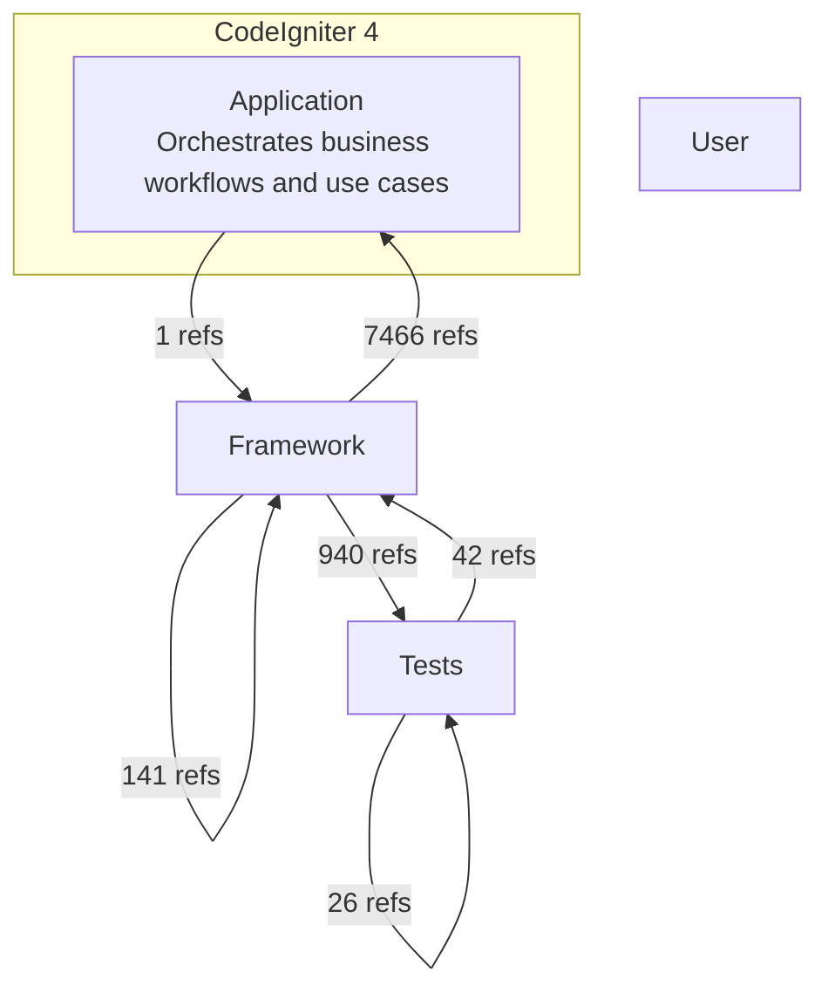

# CodeIgniter 4 - C4 Level 2: Container Architecture

**Generated:** 2025-10-15 05:06:38  
**Source:** Deptrac dependency analysis  
**Diagram Level:** C4 Level 2 (Containers)

---

## Container Diagram

---

## Architectural Violations ⚠️
- **Total**: 8616  •  **Unique layer pairs**: 6  •  **By rule (top)**: unknown ×8616
_Showing top 100 rows by count (of 8616 total). See `c4-level2-violations.json` for the full index._

| From Layer | To Layer | Count | Top files (sample) |
|---|---|---:|---|
| Framework | Application | 7466 | CodeIgniter4/system/Test/CIUnitTestCase.php ×4980, CodeIgniter4/system/Test/DatabaseTestTrait.php ×360, CodeIgniter4/system/Config/Services.php ×113 |
| Framework | Tests | 940 | CodeIgniter4/tests/system/Config/ServicesTest.php ×63, CodeIgniter4/tests/system/Test/FabricatorTest.php ×48, CodeIgniter4/tests/system/Config/FactoriesTest.php ×46 |
| Framework | Framework | 141 | CodeIgniter4/tests/system/Filters/FiltersTest.php ×30, CodeIgniter4/tests/system/Router/AutoRouterImprovedTest.php ×28, CodeIgniter4/tests/system/Config/BaseConfigTest.php ×23 |
| Tests | Framework | 42 | CodeIgniter4/tests/system/Cache/Handlers/FileHandlerTest.php ×4, CodeIgniter4/tests/system/HTTP/SiteURIFactoryTest.php ×3, CodeIgniter4/system/Config/BaseService.php ×2 |
| Tests | Tests | 26 | CodeIgniter4/tests/system/Cache/Handlers/FileHandlerTest.php ×4, CodeIgniter4/tests/system/Validation/CreditCardRulesTest.php ×2, CodeIgniter4/tests/system/Validation/DatabaseRelatedRulesTest.php ×2 |
| Application | Framework | 1 | CodeIgniter4/system/Config/BaseService.php ×1 |

---

## Next Steps
1. **Review L3 (Component View)** - Detailed component analysis per layer
2. **Address Violations** - Fix architectural rule violations
3. **Refactor** - Improve layer separation based on findings
4. **Document** - Keep architecture documentation updated

*Generated by Flowscribe - Automated C4 Architecture Documentation*