# CodeIgniter 4 - Application Layer (C4 Level 3)

**Generated:** 2025-10-15 05:08:01  
**Layer:** Application  
**Components:** 48  
**Source:** Deptrac dependency analysis

---

## Component Diagram

```mermaid
graph TB
    subgraph "Application Layer"
        subgraph "Components"
            Common[Common]
            App[App]
            Autoload[Autoload]
            Cache[Cache]
            Constants[Constants]
            ContentSecurityPolicy[ContentSecurityPolicy]
            Cookie[Cookie]
            Cors[Cors]
            CURLRequest[CURLRequest]
            Database[Database]
            DocTypes[DocTypes]
            Email[Email]
            Encryption[Encryption]
            Events[Events]
            Exceptions[Exceptions]
            Feature[Feature]
            Filters[Filters]
            ForeignCharacters[ForeignCharacters]
            Format[Format]
            Generators[Generators]
            Honeypot[Honeypot]
            Images[Images]
            Kint[Kint]
            Logger[Logger]
            Migrations[Migrations]
            Mimes[Mimes]
            Modules[Modules]
            Optimize[Optimize]
            Pager[Pager]
            Paths[Paths]
            Publisher[Publisher]
            Routes[Routes]
            Routing[Routing]
            Security[Security]
            Services[Services]
            Session[Session]
            Toolbar[Toolbar]
            UserAgents[UserAgents]
            Validation[Validation]
            View[View]
            development[development]
            production[production]
            BaseController[BaseController]
            Home[Home]
            welcome_message[welcome_message]
            error_404[error_404]
            error_exception[error_exception]
            error_400[error_400]
        end
    end

    %% Component Dependencies

    %% External Layer Dependencies
    Framework[Framework Layer]
BaseService -.-> Framework
```

---

## Component List

### Components

#### App

**Purpose:** App component

**File:** `App.php`

**Architectural Issues:** 1 violations detected

---

#### Autoload

**Purpose:** Autoload component

**File:** `Autoload.php`

**Architectural Issues:** 1 violations detected

---

#### BaseController

**Purpose:** Controls Base operations

**File:** `BaseController.php`

**Architectural Issues:** 1 violations detected

---

#### CURLRequest

**Purpose:** CURLRequest component

**File:** `CURLRequest.php`

**Architectural Issues:** 1 violations detected

---

#### Cache

**Purpose:** Cache component

**File:** `Cache.php`

**Architectural Issues:** 1 violations detected

---

#### Common

**Purpose:** Common component

**File:** `Common.php`

**Architectural Issues:** 1 violations detected

---

#### Constants

**Purpose:** Constants component

**File:** `Constants.php`

**Architectural Issues:** 1 violations detected

---

#### ContentSecurityPolicy

**Purpose:** ContentSecurityPolicy component

**File:** `ContentSecurityPolicy.php`

**Architectural Issues:** 1 violations detected

---

#### Cookie

**Purpose:** Cookie component

**File:** `Cookie.php`

**Architectural Issues:** 1 violations detected

---

#### Cors

**Purpose:** Cors component

**File:** `Cors.php`

**Architectural Issues:** 1 violations detected

---

#### Database

**Purpose:** Database component

**File:** `Database.php`

**Architectural Issues:** 1 violations detected

---

#### DocTypes

**Purpose:** DocTypes component

**File:** `DocTypes.php`

**Architectural Issues:** 1 violations detected

---

#### Email

**Purpose:** Email component

**File:** `Email.php`

**Architectural Issues:** 1 violations detected

---

#### Encryption

**Purpose:** Encryption component

**File:** `Encryption.php`

**Architectural Issues:** 1 violations detected

---

#### Events

**Purpose:** Events component

**File:** `Events.php`

**Architectural Issues:** 1 violations detected

---

#### Exceptions

**Purpose:** Exceptions component

**File:** `Exceptions.php`

**Architectural Issues:** 1 violations detected

---

#### Feature

**Purpose:** Feature component

**File:** `Feature.php`

**Architectural Issues:** 1 violations detected

---

#### Filters

**Purpose:** Filters component

**File:** `Filters.php`

**Architectural Issues:** 1 violations detected

---

#### ForeignCharacters

**Purpose:** ForeignCharacters component

**File:** `ForeignCharacters.php`

**Architectural Issues:** 1 violations detected

---

#### Format

**Purpose:** Form handling for at

**File:** `Format.php`

**Architectural Issues:** 1 violations detected

---

#### Generators

**Purpose:** Generators component

**File:** `Generators.php`

**Architectural Issues:** 1 violations detected

---

#### Home

**Purpose:** Home component

**File:** `Home.php`

**Architectural Issues:** 1 violations detected

---

#### Honeypot

**Purpose:** Honeypot component

**File:** `Honeypot.php`

**Architectural Issues:** 1 violations detected

---

#### Images

**Purpose:** Images component

**File:** `Images.php`

**Architectural Issues:** 1 violations detected

---

#### Kint

**Purpose:** Kint component

**File:** `Kint.php`

**Architectural Issues:** 1 violations detected

---

#### Logger

**Purpose:** Logger component

**File:** `Logger.php`

**Architectural Issues:** 1 violations detected

---

#### Migrations

**Purpose:** Migrations component

**File:** `Migrations.php`

**Architectural Issues:** 1 violations detected

---

#### Mimes

**Purpose:** Mimes component

**File:** `Mimes.php`

**Architectural Issues:** 1 violations detected

---

#### Modules

**Purpose:** Modules component

**File:** `Modules.php`

**Architectural Issues:** 1 violations detected

---

#### Optimize

**Purpose:** Optimize component

**File:** `Optimize.php`

**Architectural Issues:** 1 violations detected

---

#### Pager

**Purpose:** Pager component

**File:** `Pager.php`

**Architectural Issues:** 1 violations detected

---

#### Paths

**Purpose:** Paths component

**File:** `Paths.php`

**Architectural Issues:** 1 violations detected

---

#### Publisher

**Purpose:** Publisher component

**File:** `Publisher.php`

**Architectural Issues:** 1 violations detected

---

#### Routes

**Purpose:** Routes component

**File:** `Routes.php`

**Architectural Issues:** 1 violations detected

---

#### Routing

**Purpose:** Routing component

**File:** `Routing.php`

**Architectural Issues:** 1 violations detected

---

#### Security

**Purpose:** Security component

**File:** `Security.php`

**Architectural Issues:** 1 violations detected

---

#### Services

**Purpose:** Service for s

**File:** `Services.php`

**Architectural Issues:** 1 violations detected

---

#### Session

**Purpose:** Session component

**File:** `Session.php`

**Architectural Issues:** 1 violations detected

---

#### Toolbar

**Purpose:** Toolbar component

**File:** `Toolbar.php`

**Architectural Issues:** 1 violations detected

---

#### UserAgents

**Purpose:** UserAgents component

**File:** `UserAgents.php`

**Architectural Issues:** 1 violations detected

---

#### Validation

**Purpose:** Validation component

**File:** `Validation.php`

**Architectural Issues:** 2 violations detected

---

#### View

**Purpose:** View component

**File:** `View.php`

**Architectural Issues:** 1 violations detected

---

#### development

**Purpose:** development component

**File:** `development.php`

**Architectural Issues:** 1 violations detected

---

#### error_400

**Purpose:** error_400 component

**File:** `error_400.php`

**Architectural Issues:** 1 violations detected

---

#### error_404

**Purpose:** error_404 component

**File:** `error_404.php`

**Architectural Issues:** 2 violations detected

---

#### error_exception

**Purpose:** error_exception component

**File:** `error_exception.php`

**Architectural Issues:** 2 violations detected

---

#### production

**Purpose:** production component

**File:** `production.php`

**Architectural Issues:** 3 violations detected

---

#### welcome_message

**Purpose:** welcome_message component

**File:** `welcome_message.php`

**Architectural Issues:** 1 violations detected

---

## Statistics

- **Total Components:** 48
- **Component Categories:** 1
- **Internal Dependencies:** 0
- **External Dependencies:** 1

---

## Analysis Notes

⚠️ **Basic Component Analysis**

This is a basic component-level analysis extracted from Deptrac violations. For enhanced analysis with:
- Better component descriptions
- Intelligent grouping
- Architectural pattern detection
- Business context
- Refactoring recommendations

Use the LLM-enhanced version: `llm-enhancer.py --enhance-components`

---

*Component diagram generated from Deptrac dependency analysis*
