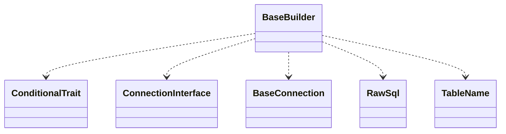

# CodeIgniter 4 - C4 Level 4: BaseBuilder

**Generated:** 2025-10-15 05:09:35  
**Type:** Other  
**File:** `system/Database/BaseBuilder.php`

---

## Component Overview

### Purpose
The BaseBuilder component provides a fluent interface for constructing SQL queries programmatically, allowing developers to build complex database queries without writing raw SQL. It supports operations like selecting fields, filtering with WHERE clauses, joining tables, and handling aggregations, while ensuring identifier protection and parameter binding for security.

### Responsibility
Manages the assembly of SQL query components into a cohesive query string, using internal state to track query parts and delegating database-specific operations like escaping and execution to the injected connection.

### Design Patterns
- Builder
- Fluent Interface
- Strategy

---

## Public Interface

```php
public select($select = '*', $escape = null)
public where($key, $value = null, $escape = null)
public orWhere($key, $value = null, $escape = null)
public join($table, $cond, $type = '', $escape = null)
public from($from, $overwrite = false)
public distinct($val = true)
public selectMax($select = '', $alias = '')
public selectMin($select = '', $alias = '')
public selectAvg($select = '', $alias = '')
public selectSum($select = '', $alias = '')
public selectCount($select = '', $alias = '')
public whereIn($key = null, $values = null, $escape = null)
public orWhereIn($key = null, $values = null, $escape = null)
public like($field, $match = '', $side = 'both', $escape = null, $insensitiveSearch = false)
public notLike($field, $match = '', $side = 'both', $escape = null, $insensitiveSearch = false)
public db()
public getTable()
public getBinds()
public testMode($mode = true)
public ignore($ignore = true)
```

---

## Key Methods

### `select()`

**Purpose:** Specifies the fields to select in the query, handling escaping and special cases like RawSql or NULL values.

**Parameters:** `$select: list<RawSql|string>|RawSql|string, $escape: ?bool`

**Returns:** `$this`

**Complexity:** Moderate

### `where()`

**Purpose:** Adds WHERE conditions to the query, handling operators, raw SQL, and automatic binding.

**Parameters:** `$key: array|RawSql|string, $value: mixed, $escape: ?bool`

**Returns:** `$this`

**Complexity:** Complex

### `join()`

**Purpose:** Adds JOIN clauses to the query, supporting different join types and condition formatting.

**Parameters:** `$table: string, $cond: RawSql|string, $type: string, $escape: ?bool`

**Returns:** `$this`

**Complexity:** Moderate

### `from()`

**Purpose:** Sets the primary table(s) for the query, handling multiple tables and aliases.

**Parameters:** `$from: array|string, $overwrite: bool`

**Returns:** `$this`

**Complexity:** Simple

### `__construct()`

**Purpose:** Initializes the builder with a table name and database connection, setting up initial state.

**Parameters:** `$tableName: array|string|TableName, $db: ConnectionInterface, $options: ?array`

**Returns:** `void`

**Complexity:** Simple

### `getBinds()`

**Purpose:** Retrieves named parameters for later binding in the Query object.

**Parameters:** ``

**Returns:** `array`

**Complexity:** Simple

---

## Dependencies



**Dependency Details:**

- **ConditionalTrait** (trait) - uses
- **ConnectionInterface** (interface) - injects
- **BaseConnection** (class) - injects
- **RawSql** (class) - uses
- **TableName** (class) - uses

---

## Internal State

- `QBSelect: array - Holds selected fields for the query.`
- `QBWhere: array - Stores WHERE conditions with prefixes and escape flags.`
- `QBJoin: array - Contains JOIN clauses.`
- `QBFrom: array - Tracks table names to select from.`
- `binds: array - Collects named parameters and values for binding.`
- `db: BaseConnection - Reference to the database connection for escaping and dialect-specific operations.`
- `tableName: string - Name of the primary table, used for alias tracking.`
- `QBOptions: array - Additional options for rendering SQL, such as field types.`

---

## Key Algorithms

### Conditional WHERE/HAVING Building (whereHaving)

Parses keys for operators, handles RawSql, subqueries, and automatic binding; crucial for secure, flexible query conditions without SQL injection risks.

### JOIN Condition Parsing

Breaks down join conditions, escapes identifiers selectively, and supports complex multi-condition joins; important for relational data handling across dialects.

### Subquery Integration (buildSubquery)

Wraps nested builders into subqueries with proper aliasing; enables complex nested queries essential for advanced reporting and filtering.


---

## Integration Points

- BaseConnection for identifier escaping, dialect-specific formatting, and query execution.
- Query object for binding parameters and final SQL compilation.

---

## Architectural Notes

BaseBuilder uses a fluent interface and internal property arrays to accumulate query parts, allowing method chaining for readable queries while deferring SQL generation until execution. It supports subclassing for database-specific drivers via the Strategy pattern. Security is prioritized through escaped identifiers and bound parameters, with flexibility for RawSql when raw queries are necessary.

---

*Generated by Flowscribe - Automated C4 Architecture Documentation*
