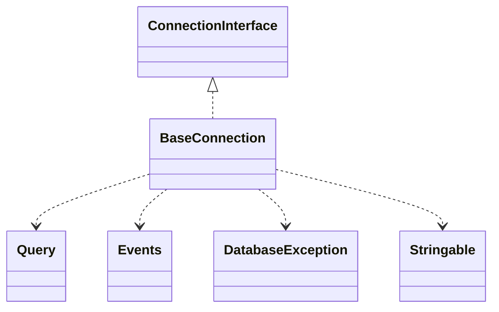

# CodeIgniter 4 - C4 Level 4: BaseConnection

**Generated:** 2025-10-15 05:09:52  
**Type:** DAO  
**File:** `system/Database/BaseConnection.php`

---

## Component Overview

### Purpose
BaseConnection is an abstract class that provides a foundational implementation for managing database connections in CodeIgniter 4, enabling the execution of SQL queries and handling of results while abstracting low-level database-specific operations. It serves as the core infrastructure for database interactions, supporting features like query building, transactions, and connection failover.

### Responsibility
Define the common interface and shared logic for establishing and managing database connections, executing queries, and handling transactions across different database drivers.

### Design Patterns
- Template Method
- Strategy

---

## Public Interface

```php
public getConnection(?string $alias = null)
public getDatabase(): string
public setPrefix(string $prefix = ''): string
public getPrefix(): string
public getPlatform(): string
public setAliasedTables(array $aliases)
public addTableAlias(string $alias)
public query(string $sql, $binds = null, bool $setEscapeFlags = true, string $queryClass = '')
public simpleQuery(string $sql)
public transOff()
public transStrict(bool $mode = true)
public transStart(bool $testMode = false): bool
public transException(bool $transException)
public transComplete(): bool
public transStatus(): bool
public transBegin(bool $testMode = false): bool
public transCommit(): bool
public transRollback(): bool
public resetTransStatus(): static
public table($tableName)
public newQuery(): BaseBuilder
public prepare(Closure $func, array $options = [])
public getLastQuery()
public showLastQuery(): string
public getConnectStart(): ?float
public getConnectDuration(int $decimals = 6): string
public protectIdentifiers($item, bool $prefixSingle = false, ?bool $protectIdentifiers = null, bool $fieldExists = true)
public isWriteType(string $sql): bool
```

---

## Key Methods

### `__construct()`

**Purpose:** Initializes the connection object with provided parameters, sets up date formats and failover configurations, and determines the appropriate query class.

**Parameters:** `array $params`

**Returns:** `void`

**Complexity:** Simple

### `initialize()`

**Purpose:** Establishes the database connection, handles failover if primary connection fails, and measures connection duration.

**Parameters:** `void`

**Returns:** `void`

**Complexity:** Moderate

### `query()`

**Purpose:** Executes a query against the database, handling caching, transactions, and result processing, while integrating with the Query Builder and events system.

**Parameters:** `string $sql, array|string|null $binds = null, bool $setEscapeFlags = true, string $queryClass = ''`

**Returns:** `BaseResult|bool|Query`

**Complexity:** Complex

### `protectIdentifiers()`

**Purpose:** Protects and prefixes database identifiers (tables/columns) to prevent SQL injection and ensure proper escaping based on the database platform.

**Parameters:** `array|int|string|TableName $item, bool $prefixSingle = false, ?bool $protectIdentifiers = null, bool $fieldExists = true`

**Returns:** `array|string`

**Complexity:** Moderate

### `transStart()`

**Purpose:** Initiates a database transaction, managing nested transactions and enabling test mode for rollbacks.

**Parameters:** `bool $testMode = false`

**Returns:** `bool`

**Complexity:** Simple

### `table()`

**Purpose:** Creates a new Query Builder instance for a specified table, facilitating database operations through a fluent interface.

**Parameters:** `array|string|TableName $tableName`

**Returns:** `BaseBuilder`

**Complexity:** Simple

---

## Dependencies



**Dependency Details:**

- **ConnectionInterface** (interface) - implements
- **Query** (class) - uses
- **Events** (class) - uses
- **DatabaseException** (class) - uses
- **Stringable** (trait) - uses

---

## Internal State

- `connID: false|TConnection - Holds the active database connection resource, set to false if not connected`
- `resultID: false|TResult - Stores the result identifier from the last executed query`
- `DBPrefix: string - Database table prefix applied to queries`
- `transDepth: int - Current depth level of nested transactions`
- `transStatus: bool - Flag indicating overall transaction status for rollback decisions`
- `transFailure: bool - Flag set to true if a transaction query fails`
- `failover: array - Configuration array for secondary database connections in case of primary failure`
- `aliasedTables: list<string> - List of table aliases used in queries for correct identifier protection`

---

## Key Algorithms

### Connection Initialization with Failover

Upon initialization, attempts to connect to the primary database and, if unsuccessful, iteratively tries failover configurations by overriding connection properties; this ensures high availability for database access in production environments.

### Transaction Management

Manages nested transactions by tracking depth and status, only committing or rolling back at the outermost level, while supporting strict mode for cascading failures; this prevents partial commits in complex query operations.

### Identifier Protection

Parses and escapes database identifiers (e.g., table.column AS alias), applying prefixes and escaping based on database rules to prevent injection and ensure compatibility across platforms.


---

## Integration Points

- Database Drivers (e.g., MySQLi, PostgreSQL) for platform-specific implementations
- Query Builder (BaseBuilder) for constructing SQL queries
- Events System for triggering hooks like 'DBQuery' on query execution
- PreparedQuery for handling parameterized statements
- External database servers via DSN-based connections with support for persistent and failover setups

---

## Architectural Notes

BaseConnection employs the Template Method pattern by defining abstract methods like execute() and _close(), allowing concrete drivers to customize low-level operations while preserving consistent high-level behavior. It implements a Strategy pattern through ConnectionInterface to swap between database drivers seamlessly. Key constraints include dependency on PHP's PDO or driver-specific extensions for actual connectivity, and it ensures thread-safety in multi-request environments by isolating connection state.

---

*Generated by Flowscribe - Automated C4 Architecture Documentation*
