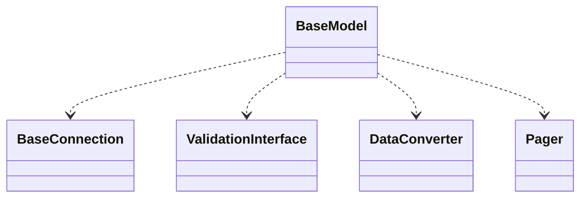

# CodeIgniter 4 - C4 Level 4: BaseModel

**Generated:** 2025-10-15 05:09:20  
**Type:** DAO  
**File:** `system/BaseModel.php`

---

## Component Overview

### Purpose
BaseModel is an abstract class that provides foundational ORM-like functionality for database interaction in CodeIgniter 4, handling data validation, timestamps, soft deletes, callbacks, and CRUD operations to simplify database management.

### Responsibility
Serves as a base for concrete model classes, encapsulating database access and business logic for entity manipulation while ensuring data integrity and extensibility.

### Design Patterns
- DAO
- Template Method
- Observer

---

## Public Interface

```php
public find($id = null)
public findAll(?int $limit = null, int $offset = 0)
public first()
public save($row)
public insert($row = null, bool $returnID = true)
public update($id = null, $row = null)
public delete($id = null, bool $purge = false)
public getInsertID()
public asArray()
public asObject($class = 'stdClass')
public protect(bool $protect = true)
public withDeleted(bool $withDeleted = true)
public skipValidation(bool $skip = true)
public allowCallbacks(bool $allow = true)
public cleanRules(bool $clean = true)
public chunk(int $size, Closure $userFunc)
```

---

## Key Methods

### `find()`

**Purpose:** Fetches a single record or multiple records by ID, integrating callbacks and handling return types.

**Parameters:** `array|int|string|null $id`

**Returns:** `array|object|null|list<array|object>`

**Complexity:** Moderate

### `findAll()`

**Purpose:** Retrieves all records, optionally limited and offset, with callback support.

**Parameters:** `int|null $limit, int $offset = 0`

**Returns:** `array`

**Complexity:** Moderate

### `insert()`

**Purpose:** Inserts a new record, handling validation, timestamps, and callbacks.

**Parameters:** `object|array|null $row, bool $returnID = true`

**Returns:** `bool|int|string`

**Complexity:** Complex

### `update()`

**Purpose:** Updates an existing record by ID, with validation and callback integration.

**Parameters:** `array|int|string|null $id, array|object|null $row`

**Returns:** `bool`

**Complexity:** Complex

### `save()`

**Purpose:** Determines whether to insert or update based on the data, automating decision-making for persistence.

**Parameters:** `object|array $row`

**Returns:** `bool`

**Complexity:** Moderate

### `delete()`

**Purpose:** Deletes a record, supporting soft deletes and callbacks.

**Parameters:** `array|int|string|null $id, bool $purge = false`

**Returns:** `bool|string`

**Complexity:** Moderate

---

## Dependencies



**Dependency Details:**

- **BaseConnection** (class) - injects
- **ValidationInterface** (interface) - injects
- **DataConverter** (class) - uses
- **Pager** (class) - uses

---

## Internal State

- `$db: BaseConnection - The database connection instance used for queries`
- `$insertID: int|string - Stores the last inserted ID after an insert operation`
- `$returnType: string - Determines the format of returned data (array, object, etc.)`
- `$tempReturnType: 'array'|'object'|class-string - Temporary override for return type`
- `$allowedFields: list<string> - Lists fields allowed for mass assignment to prevent vulnerabilities`
- `$useTimestamps: bool - Enables automatic creation and update of timestamp fields`
- `$useSoftDeletes: bool - Enables soft deletion by marking records instead of hard deleting`
- `$validationRules: array - Holds validation rules for data integrity`
- `$skipValidation: bool - Allows bypassing validation for operations`
- `$beforeInsert, $afterInsert, etc.: list<string> - Arrays of callback method names for lifecycle events`

---

## Key Algorithms

### Save Decision Algorithm

In the save() method, it checks if the row has an ID; if yes, updates; otherwise, inserts, promoting atomic operations.

### Callback Triggering Mechanism

Uses the trigger() method to dynamically call callback methods at various lifecycle points (before/after find, insert, update, delete), enabling extensible business logic.


---

## Integration Points

- CodeIgniter Database layer via BaseConnection for executing queries
- Validation system via ValidationInterface for data validation
- DataConverter for handling type casting of database fields
- Pager component for pagination in queries

---

## Architectural Notes

BaseModel employs the Template Method pattern by defining abstract do* methods for subclasses to implement, ensuring consistent structure across models. It incorporates security features like mass assignment protection and extensibility through callbacks, following DAO principles for database abstraction. The design balances performance with features like soft deletes and timestamps, promoting code reusability in the framework.

---

*Generated by Flowscribe - Automated C4 Architecture Documentation*
