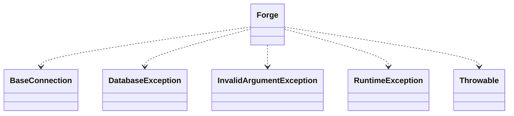

# CodeIgniter 4 - C4 Level 4: Forge

**Generated:** 2025-10-15 05:10:22  
**Type:** Service  
**File:** `system/Database/Forge.php`

---

## Component Overview

### Purpose
The Forge class serves as a tool for managing database schemas by generating and executing SQL statements for creating, modifying, and dropping tables and indexes. It abstracts schema operations to enable programmatic database-driven migrations in CodeIgniter 4.

### Responsibility
Managing database schema operations, including table creation, modification, and key management, by translating field definitions and constraints into executable SQL.

### Design Patterns
- Builder
- Strategy

---

## Public Interface

```php
public getConnection()
public createDatabase(string $dbName, bool $ifNotExists = false)
public dropDatabase(string $dbName)
public addKey($key, bool $primary = false, bool $unique = false, string $keyName = '')
public addPrimaryKey($key, string $keyName = '')
public addUniqueKey($key, string $keyName = '')
public addField($fields)
public addForeignKey($fieldName = '', string $tableName = '', $tableField = '', string $onUpdate = '', string $onDelete = '', string $fkName = '')
public dropKey(string $table, string $keyName, bool $prefixKeyName = true)
public dropPrimaryKey(string $table, string $keyName = '')
public dropForeignKey(string $table, string $foreignName)
public createTable(string $table, bool $ifNotExists = false, array $attributes = [])
public dropTable(string $tableName, bool $ifExists = false, bool $cascade = false)
public renameTable(string $tableName, string $newTableName)
public addColumn(string $table, $fields)
public dropColumn(string $table, $columnNames)
public modifyColumn(string $table, $fields)
```

---

## Key Methods

### `createTable()`

**Purpose:** Generates and executes SQL to create a new table based on added fields, keys, and other attributes.

**Parameters:** `string $table, bool $ifNotExists = false, array $attributes = []`

**Returns:** `bool`

**Complexity:** Complex

### `addField()`

**Purpose:** Adds field definitions to the internal state for inclusion in table creation or alteration.

**Parameters:** `array<string, array|string>|string $fields`

**Returns:** `Forge`

**Complexity:** Moderate

### `addKey()`

**Purpose:** Adds primary, unique, or regular keys to the internal state for schema definition.

**Parameters:** `array|string $key, bool $primary = false, bool $unique = false, string $keyName = ''`

**Returns:** `Forge`

**Complexity:** Simple

### `createDatabase()`

**Purpose:** Creates a new database if specified, with optional conditional checks.

**Parameters:** `string $dbName, bool $ifNotExists = false`

**Returns:** `bool`

**Complexity:** Moderate

### `_processFields()`

**Purpose:** Processes raw field definitions into structured arrays for SQL generation during table operations.

**Parameters:** `bool $createTable = false`

**Returns:** `array`

**Complexity:** Complex

---

## Dependencies



**Dependency Details:**

- **BaseConnection** (class) - injects
- **DatabaseException** (class) - uses
- **InvalidArgumentException** (class) - uses
- **RuntimeException** (class) - uses
- **Throwable** (class) - uses

---

## Internal State

- `$db: BaseConnection - Holds the active database connection instance for executing queries.`
- `$fields: array<string, array<string, bool|string>|string> - Stores field definitions as key-value pairs for table schema building.`
- `$keys: list<array{fields?: list<string>, keyName?: string}> - List of non-primary keys added to the schema.`
- `$uniqueKeys: array - Indexes of keys that are uniquely constrained.`
- `$primaryKeys: array{fields?: list<string>, keyName?: string} - Definition of the primary key.`
- `$foreignKeys: array - List of foreign key constraints.`
- `$charset: string - Character set used for database operations.`

---

## Key Algorithms

### Field Processing Algorithm

Transforms user-defined field attributes (e.g., type, nullability, defaults) into database-specific column definitions, handling type mapping and constraint application for schema generation.

### Key Processing Algorithm

Converts key definitions into SQL statements for indexes and constraints, distinguishing between primary, unique, and foreign keys to ensure proper schema integrity.

### Table Creation Algorithm

Assembles processed fields, keys, and attributes into CREATE TABLE SQL, executing additional index creation separately if needed, to adapt to database driver limitations.


---

## Integration Points

- BaseConnection for executing SQL queries and escaping identifiers.
- Database drivers (e.g., MySQL, PostgreSQL) via extended classes that override platform-specific SQL string templates and attribute processing.
- CodeIgniter's Migration system for defining and applying schema changes.

---

## Architectural Notes

The Forge uses a fluent Builder pattern for accumulating field and key definitions before executing schema operations, allowing for flexible and composable API. It employs the Strategy pattern by providing extensible hooks for database-specific variations through protected methods like _attributeType and _processColumn, which child classes implement. This design ensures cross-database compatibility while centralizing schema generation logic.

---

*Generated by Flowscribe - Automated C4 Architecture Documentation*
