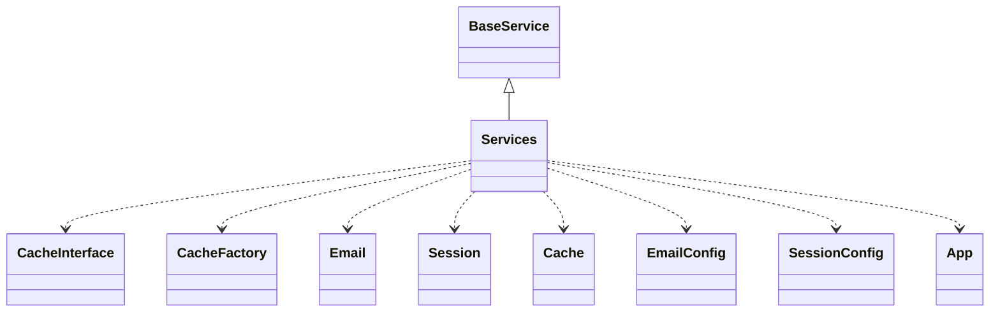

# CodeIgniter 4 - C4 Level 4: Services

**Generated:** 2025-10-15 05:11:24  
**Type:** Factory  
**File:** `system/Config/Services.php`

---

## Component Overview

### Purpose
The Services component in CodeIgniter 4 acts as a centralized dependency injection container that manages the instantiation and sharing of core framework services, such as caching, session handling, and security, to facilitate loose coupling and easy swapping of implementations.

### Responsibility
To provide a simplified, non-heavyweight mechanism for instantiating and managing shared instances of essential framework services, replacing traditional dependency injection containers for better maintainability and IDE support.

### Design Patterns
- Factory Method
- Service Locator
- Singleton

---

## Public Interface

```php
public cache()
public clirequest()
public codeigniter()
public commands()
public csp()
public curlrequest()
public email()
public encrypter()
public exceptions()
public filters()
public format()
public honeypot()
public image()
public iterator()
public language()
public logger()
public migrations()
public negotiator()
public responsecache()
public pager()
public parser()
public renderer()
public request()
public createRequest()
public incomingrequest()
public response()
public redirectresponse()
public routes()
public router()
public security()
public session()
public siteurifactory()
public superglobals()
public throttler()
public timer()
public toolbar()
public uri()
public validation()
public viewcell()
public typography()
```

---

## Key Methods

### `cache()`

**Purpose:** Returns a cache handler instance for storing and retrieving data, using the configured cache settings.

**Parameters:** `Cache $config (optional), bool $getShared (default true)`

**Returns:** `CacheInterface`

**Complexity:** Simple

### `email()`

**Purpose:** Provides an email service instance configured for sending emails via various protocols like mail, sendmail, or SMTP.

**Parameters:** `array|EmailConfig $config (optional), bool $getShared (default true)`

**Returns:** `Email`

**Complexity:** Simple

### `session()`

**Purpose:** Instantiates and returns a session manager with appropriate handlers based on configuration, handling platform-specific setup for database sessions.

**Parameters:** `SessionConfig $config (optional), bool $getShared (default true)`

**Returns:** `Session`

**Complexity:** Moderate

### `renderer()`

**Purpose:** Creates a view renderer for displaying output, configured with paths and settings for template rendering.

**Parameters:** `string $viewPath (optional), ViewConfig $config (optional), bool $getShared (default true)`

**Returns:** `View`

**Complexity:** Simple

### `validation()`

**Purpose:** Provides a validation service for input data, using configured rules and a renderer for error handling.

**Parameters:** `ValidationConfig $config (optional), bool $getShared (default true)`

**Returns:** `ValidationInterface`

**Complexity:** Simple

---

## Dependencies



**Dependency Details:**

- **BaseService** (class) - extends
- **CacheInterface** (interface) - uses
- **CacheFactory** (class) - uses
- **Email** (class) - injects
- **Session** (class) - injects
- **Cache** (config) - uses
- **EmailConfig** (config) - uses
- **SessionConfig** (config) - uses
- **App** (config) - uses

---

## Internal State

- `$instances: array - Stores shared instances of services keyed by name to avoid reinstantiation`

---

## Key Algorithms

### Shared Instance Management

Uses getSharedInstance to return pre-created singleton instances when $getShared is true, reducing overhead and ensuring consistent state across the application.

### Session Handler Resolution

Dynamically determines the appropriate database session handler (e.g., MySQLiHandler or PostgreHandler) based on the platform, validating class existence and compatibility for secure and flexible session management.


---

## Integration Points

- Cache handlers via CacheFactory
- Database connections for session and migration services
- Configuration classes like App, Cache, Email, etc., for service initialization
- Logger and Request services for error handling and context
- Superglobals for URI and request handling

---

## Architectural Notes

The Services class employs static methods for simplicity and IDE discoverability over dynamic DI containers, allowing easy extension for custom services while enforcing shared instances for performance. It decouples service instantiation from usage, promoting modularity, and includes backward compatibility features like deprecated parameters. Design prioritizes zero-configuration defaults with optional overrides for flexibility in customizing core behaviors.

---

*Generated by Flowscribe - Automated C4 Architecture Documentation*
