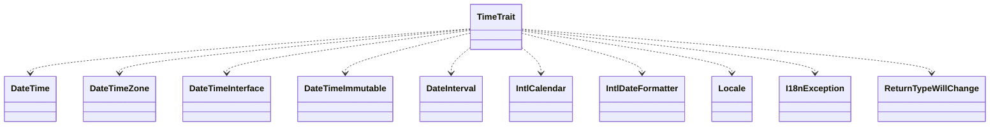

# CodeIgniter 4 - C4 Level 4: TimeTrait

**Generated:** 2025-10-15 05:11:10  
**Type:** Other  
**File:** `system/I18n/TimeTrait.php`

---

## Component Overview

### Purpose
This trait provides a comprehensive set of methods for creating, manipulating, and formatting date and time objects in CodeIgniter, with built-in support for timezones, locales, and internationalization to handle temporal operations in web applications.

### Responsibility
To encapsulate time-related functionality including parsing, creation, modification, comparison, and formatting of Time instances with proper timezone and locale handling, ensuring immutable behavior for safe date manipulations.

### Design Patterns
- Factory Method
- Immutable Objects
- Mixin (via trait for code reuse)

---

## Public Interface

```php
public now($timezone = null, ?string $locale = null)
public parse(string $datetime, $timezone = null, ?string $locale = null)
public today($timezone = null, ?string $locale = null)
public createFromDate(?int $year = null, ?int $month = null, ?int $day = null, $timezone = null, ?string $locale = null)
public addSeconds(int $seconds)
public subSeconds(int $seconds)
public humanize()
public difference($testTime, ?string $timezone = null)
public equals($testTime, ?string $timezone = null)
public toLocalizedString(?string $format = null)
```

---

## Key Methods

### `__construct()`

**Purpose:** Initializes a Time instance with optional time string, timezone, and locale, handling relative keywords and test instances.

**Parameters:** `?string $time, DateTimeZone|string|null $timezone, ?string $locale`

**Returns:** `void`

**Complexity:** Moderate

### `now()`

**Purpose:** Creates a new Time instance representing the current time in the specified timezone and locale.

**Parameters:** `DateTimeZone|string|null $timezone, ?string $locale`

**Returns:** `static`

**Complexity:** Simple

### `parse()`

**Purpose:** Parses a datetime string into a new Time instance with optional timezone and locale.

**Parameters:** `string $datetime, DateTimeZone|string|null $timezone, ?string $locale`

**Returns:** `static`

**Complexity:** Simple

### `addSeconds()`

**Purpose:** Returns a new Time instance with the specified number of seconds added, maintaining immutability.

**Parameters:** `int $seconds`

**Returns:** `static`

**Complexity:** Simple

### `humanize()`

**Purpose:** Generates a human-readable string describing the time difference relative to now, such as '3 weeks ago' or 'in 4 days'.

**Parameters:** `none`

**Returns:** `string`

**Complexity:** Complex

### `difference()`

**Purpose:** Calculates the difference between the current Time instance and another datetime, returning a TimeDifference object.

**Parameters:** `DateTimeInterface|static|string $testTime, ?string $timezone`

**Returns:** `TimeDifference`

**Complexity:** Moderate

---

## Dependencies



**Dependency Details:**

- **DateTime** (class) - uses
- **DateTimeZone** (class) - uses
- **DateTimeInterface** (class) - uses
- **DateTimeImmutable** (class) - uses
- **DateInterval** (class) - uses
- **IntlCalendar** (class) - uses
- **IntlDateFormatter** (class) - uses
- **Locale** (interface) - uses
- **I18nException** (class) - uses
- **ReturnTypeWillChange** (trait) - uses
- **Exception** (class) - uses

---

## Internal State

- `$timezone: DateTimeZone|string - Stores the current timezone for the Time instance.`
- `$locale: string - Holds the locale setting for internationalization of dates and times.`
- `$toStringFormat: string - Default format used when converting to string.`
- `$relativePattern: string - Regular expression pattern to detect relative time keywords.`
- `$testNow: DateTimeInterface|static|null - Static property for testing, holding a mock 'now' time.`

---

## Key Algorithms

### Relative Time Parsing

Detects and adjusts relative time strings (e.g., 'next Tuesday') using a regex pattern, ensuring proper timezone handling for dynamic date creation.

### Humanize Time Differences

Calculates and formats human-readable time differences (e.g., '3 hours ago') using IntlCalendar to compare dates across years, months, days, hours, and minutes, promoting user-friendly date displays.

### Immutable Time Modifications

Ensures all modification methods (add, subtract) return new instances, preserving the original object's state and supporting thread-safe, safe date manipulations.


---

## Integration Points

- PHP's Intl extension (IntlCalendar, IntlDateFormatter) for locale-aware date and time formatting and calculations.
- CodeIgniter's I18n system for exception handling (I18nException) and language strings in humanize method.
- System timezone settings via date_default_timezone_get().

---

## Architectural Notes

The trait emphasizes immutability by returning new instances for all modifications, aligning with functional programming principles to prevent accidental state mutations. It leverages PHP's Intl components for robust internationalization, ensuring consistent and culturally appropriate time representations. Static factories provide flexible creation points, while the trait design allows seamless composition into Time classes once TimeLegacy is removed.

---

*Generated by Flowscribe - Automated C4 Architecture Documentation*
