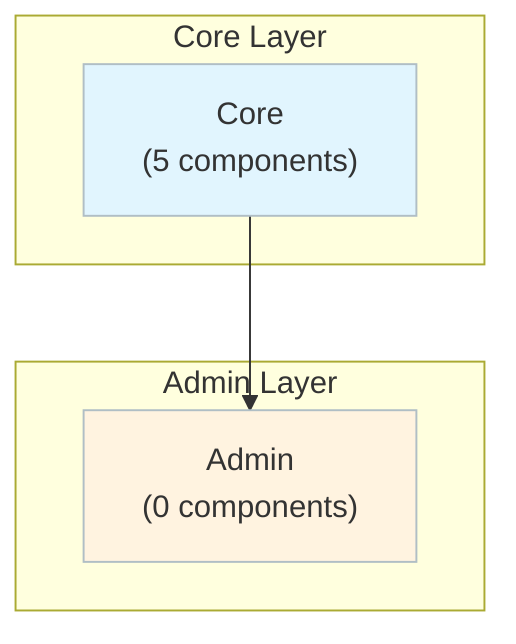

# WordPress - Complete C4 Architecture Documentation
**Generated by Flowscribe**  
**Date:** 2025-10-15  
**Analysis Cost:** $0.398  
**Total Components (Deptrac):** 5  
**L4 Component Docs:** 12  
**Architecture Grade:** C+

---

## 📋 Table of Contents

1. [Quick Start](#quick-start)
2. [Documentation Levels](#documentation-levels)
3. [Architecture Overview](#architecture-overview)
4. [C4 Level 1: System Context](#c4-level-1-system-context)
5. [C4 Level 2: Containers](#c4-level-2-containers)
6. [C4 Level 3: Components](#c4-level-3-components)
7. [C4 Level 4: Code](#c4-level-4-code)
8. [Architecture Review](#architecture-review)
9. [Key Insights](#key-insights)
10. [Refactoring Priorities](#refactoring-priorities)
11. [How to Use This Documentation](#how-to-use-this-documentation)

---

## Quick Start

**Path 1: High-Level Overview (5 minutes)**
1. 📊 [C4 Level 1: System Context](./c4-level1.md) - Who uses it, what it connects to
2. 🗄️ [C4 Level 2: Containers](./c4-level2.md) - Major architectural layers
3. ⚡ Key insights below

**Path 2: Architecture Deep Dive (30 minutes)**
1. Start with Path 1 above
2. 🔍 [C4 Level 3: Components](#c4-level-3-components) - Pick a layer to explore
3. 💡 [C4 Level 4: Code Hub](./c4-level4.md) - Understand key components
4. 📋 [Architecture Review](./architecture-review.md) - Expert assessment and recommendations

**Path 3: Component-Focused**
1. 📚 [C4 Level 4: Code Hub](./c4-level4.md)
2. 🔬 Dive into specific component documentation
3. 🔄 Trace back to L3 and L2 for context

---

## Documentation Levels

| Level | Document | What It Shows | Audience | Status |
|------:|----------|---------------|----------|--------|
| **L1** | [System Context](./c4-level1.md) | Boundaries, users, externals | Everyone | ✅ |
| **L2** | [Containers](./c4-level2.md) | High-level architecture | Architects/Leads | ✅ |
| **L3** | [Components](#c4-level-3-components) | Components by layer | Devs/Architects | ✅ |
| **L4** | [Code](./c4-level4.md) | Code-level design | Sr Devs/Architects | ✅ |
| **Review** | [Architecture Review](./architecture-review.md) | Assessment + roadmap | Architects/Leads | ✅ |

---

## Architecture Overview

**Key Statistics**
- **Architectural Layers:** 2
- **Total Components (Deptrac):** 5
- **L4 Component Docs:** 12
- **Architectural Violations:** 10
- **Uncovered dependencies:** 160
- **Architecture Grade:** C+
- **Analysis Cost:** $0.398
- **Analysis Tokens:** 184,941

### Rich Layered Overview

### Layers
- **Core:** 5 components
- **Admin:** 0 components

### Layer Documentation
- **Admin:** ✅ [L3 Documentation →](./c4-level3-admin.md) — 0 components
- **Core:** ✅ [L3 Documentation →](./c4-level3-core.md) — 5 components

---

## C4 Level 1: System Context
📄 **[Open L1 →](./c4-level1.md)** ✅

## C4 Level 2: Containers
📄 **[Open L2 →](./c4-level2.md)** ✅

## C4 Level 3: Components
_See layer links above_

## C4 Level 4: Code
📄 **[Open L4 Hub →](./c4-level4.md)** ✅

---

## Architecture Review
📋 **[Open Review →](./architecture-review.md)** ✅

### Executive Summary
WordPress exhibits the architectural characteristics of a legacy monolithic CMS that has evolved over 20+ years from a simple blogging platform to a complex content management system. The codebase reveals significant technical debt, particularly in its layer separation and dependency management, with 10 architectural violations indicating improper dependencies from Core to Admin layers. The system demonstrates a procedural-to-object-oriented transition that remains incomplete, with heavy reliance on global state, procedural functions mixed with OOP patterns, and inconsistent architectural boundaries.

Despite these challenges, WordPress maintains remarkable backward compatibility and extensibility through its plugin/hook system, which has become both its greatest strength and architectural constraint. The recent addition of the Block Editor (Gutenberg) introduces modern patterns but also creates architectural friction with the legacy codebase. The system's scalability is proven in production at massive scale, yet individual component quality varies dramatically from well-architected (e.g., REST API, HTML Processor) to deeply problematic (e.g., wpdb global coupling, mixed concerns in wp-includes).

The fundamental challenge is that WordPress must simultaneously serve as a simple blogging tool, enterprise CMS, and application framework—requirements that create inherent architectural tensions that cannot be fully resolved without breaking backward compatibility, which remains the project's paramount constraint.

**Grade:** C+

---

## Analysis Metrics

**Total Cost:** $0.3981  
**Total Tokens:** 184,941  
**Total Time:** 438.4s (7.3 minutes)

## 📊 Cost & Usage Summary

| Stage | Model | Cost (USD) | Tokens (in/out) | Duration (s) |
|-------|-------|-----------:|----------------:|-------------:|
| 🧭 C4 Level 1 - Context | x-ai/grok-code-fast-1 | $0.0018 | 3,231 / 1,171 | 13.1 |
| 🏗️ C4 Level 2 - Containers | none | $0.0000 | 0 / 0 | 0.0 |
| ⚙️ C4 Level 4 - Code | x-ai/grok-code-fast-1 | $0.0498 | 90,435 / 21,471 | 189.9 |
| 🧱 Architecture Review | anthropic/claude-sonnet-4.5 | $0.3464 | 56,921 / 11,712 | 204.5 |
| 💼 **TOTAL** |  | **$0.3981** | **150,587 / 34,354** | **407.6** |

_Legend: **in** = prompt tokens, **out** = completion tokens. All costs are from OpenRouter usage accounting._

---

## Files
- `README.md` (this index)
- `c4-level1.md`, `c4-level2.md`, `c4-level4.md`, `architecture-review.md`
- `c4-level3-*.md` (per-layer components)
- `.c4-level*-metrics.json`, `.architecture-review-metrics.json`, `.flowscribe-metrics.json`

**Last Updated:** 2025-10-15 04:28:04
