# WordPress - C4 Level 1: System Context

**Generated:** 2025-10-15 04:20:40  
**Domain:** content management  
**Diagram Level:** C4 Level 1 (System Context)

---

## System Overview

### Description
WordPress is an open-source content management system (CMS) designed for creating and managing websites, blogs, and online publications. It runs on a web server and stores data in a database, allowing users to publish content easily. The system emphasizes simplicity, extensibility through plugins, and community-driven development.

### Purpose
WordPress enables users to create, publish, and manage digital content on the web through a user-friendly interface.

### Key Features
- Famous 5-minute installation process with database setup
- Automatic and manual update mechanisms for core software
- Robust plugin API for extensibility without modifying core code
- Import functionality from other content management systems

---

## Users and Actors

### Site Administrator

**Role:** Manages the overall setup, configuration, updates, and maintenance of the WordPress site.

**Primary Actions:**
- Install and configure WordPress
- Run updates (automatic or manual)
- Access administrative dashboard for site management

### Content Publisher

**Role:** Creates and publishes articles, pages, and media content on the site.

**Primary Actions:**
- Log in to wp-admin
- Create and edit posts/pages
- Upload media files

### Developer/Plugin Contributor

**Role:** Extends WordPress functionality by building plugins, themes, or integrating with external systems.

**Primary Actions:**
- Use Plugin API to develop extensions
- Access support forums for troubleshooting
- Contribute to the project via development tools

---

## External Systems and Integrations

### MySQL/MariaDB Database

**Purpose:** Stores all site data including posts, users, settings, and metadata.

**Integration Type:** Database

**Data Flow:** WordPress connects via PHP to read/write configurations, content, and user data using defined DB settings (host, user, password).

### Web Server (e.g., Apache)

**Purpose:** Hosts the WordPress files and handles HTTP requests for site delivery.

**Integration Type:** File System/Protocol (HTTP/HTTPS)

**Data Flow:** Serves static assets and processes dynamic PHP scripts; supports features like mod_rewrite for clean URLs and SSL for secure connections.

### Import Tools (e.g., from other CMS)

**Purpose:** Allows migration of content from external publishing platforms.

**Integration Type:** API/File Import

**Data Flow:** Imports data from XML files or APIs of systems like Blogger or Movable Type; data includes posts, comments, and users.

---

## System Context Diagram

```mermaid
flowchart TB
    User["👤 Users<br/>Various user types"]
    System["🏛️ WordPress<br/>WordPress enables users to create, publish, and manage digital content on the web through a user-friendly interface."]
    Ext0["🔗 MySQL/MariaDB Database<br/>Stores all site data including posts, users, settings, and metadata."]
    Ext1["🔗 Web Server (e.g., Apache)<br/>Hosts the WordPress files and handles HTTP requests for site delivery."]
    Ext2["🔗 Import Tools (e.g., from other CMS)<br/>Allows migration of content from external publishing platforms."]
    User -->|Uses| System
    System -->|Database| Ext0
    System -->|File System/Protocol - HTTP/HTTPS | Ext1
    System -->|API/File Import| Ext2
```

