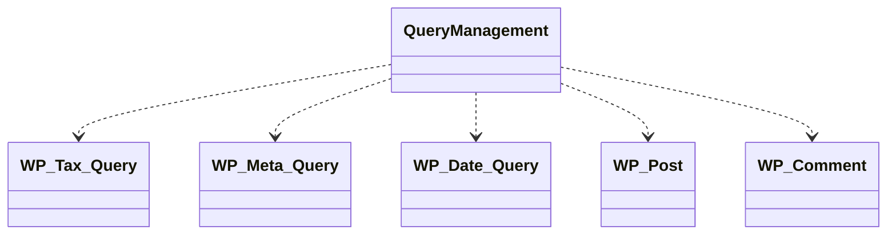

# WordPress - C4 Level 4: Query Management

**Generated:** 2025-10-15 04:24:06  
**Type:** Service  
**File:** `wp-includes/class-wp-query.php`

---

## Component Overview

### Purpose
The WP_Query class manages the parsing, execution, and retrieval of posts, pages, and other content from the WordPress database, handling complex filtering by categories, tags, metadata, dates, and more, while supporting pagination and performance optimizations through caching and lazy loading.

### Responsibility
To encapsulate the logic for constructing and executing database queries for WordPress content, ensuring efficient data retrieval and state management throughout the query lifecycle.

### Design Patterns
- Builder
- Strategy

---

## Public Interface

```php
public init()
public parse_query( $query = '' )
public parse_query_vars()
public fill_query_vars( $query_vars )
```

---

## Key Methods

### `parse_query()`

**Purpose:** Parses the input query parameters, sanitizes them, sets query flags, and prepares the query for execution

**Parameters:** `string|array $query (optional array or string of query parameters)`

**Returns:** `void`

**Complexity:** Complex

### `fill_query_vars()`

**Purpose:** Inserts default values for any query variables not provided, ensuring a complete set of parameters

**Parameters:** `array $query_vars (defined query variables)`

**Returns:** `array (complete query variables with defaults filled)`

**Complexity:** Moderate

### `init()`

**Purpose:** Resets the object properties and initializes default values for a fresh query instance

**Parameters:** `none`

**Returns:** `void`

**Complexity:** Simple

### `init_query_flags()`

**Purpose:** Resets all query type boolean flags to false, preparing for re-parsing

**Parameters:** `none`

**Returns:** `void`

**Complexity:** Simple

---

## Dependencies



**Dependency Details:**

- **WP_Tax_Query** (class) - uses
- **WP_Meta_Query** (class) - uses
- **WP_Date_Query** (class) - uses
- **WP_Post** (class) - uses
- **WP_Comment** (class) - uses

---

## Internal State

- `query: array - Array of raw query parameters passed to the class`
- `query_vars: array - Sanitized and filled query variables after parsing`
- `tax_query: WP_Tax_Query|null - Instance for handling taxonomy-based queries`
- `meta_query: WP_Meta_Query - Instance for handling metadata-based queries`
- `date_query: WP_Date_Query - Instance for handling date-based queries`
- `queried_object: WP_Term|WP_Post_Type|WP_Post|WP_User|null - The specific object being queried`
- `posts: WP_Post[]|int[] - Array of retrieved post objects or IDs`
- `is_single: bool - Flag indicating a single post query`
- `is_archive: bool - Flag for archive queries`
- `is_home: bool - Flag for homepage queries`
- `is_404: bool - Flag for not found queries`

---

## Key Algorithms

### Query Parsing and Sanitization

Processes input parameters, validates and sanitizes them (e.g., ensuring scalars, regex replacements for security), and sets boolean flags to determine query types, critical for preventing invalid queries and enabling conditional logic in themes/templates.

### SQL Query Building

Constructs the SQL statement based on parsed variables, joining tables for taxonomies, metadata, and dates, while handling pagination and ordering, important for efficient database interaction and performance under varying load.


---

## Integration Points

- WordPress database tables (wp_posts, wp_postmeta, wp_term_relationships, etc.) for executing queries
- WordPress caching system for query results and metadata to improve performance
- WP_Date_Query, WP_Meta_Query, and WP_Tax_Query classes for specialized sub-queries
- Global function hooks like pre_get_posts for modifying queries before execution

---

## Architectural Notes

WP_Query employs a builder pattern for constructing complex queries incrementally and a strategy pattern through composite query objects (e.g., tax_query, meta_query) for extensible, type-specific logic. It prioritizes performance with caching (query_cache_key) and lazy loading to avoid unnecessary data fetches, but imposes constraints on query complexity to maintain scalability, often delegating to specialized query classes to keep the core logic manageable.

---

*Generated by Flowscribe - Automated C4 Architecture Documentation*
