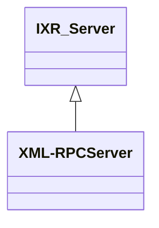

# WordPress - C4 Level 4: XML-RPC Server

**Generated:** 2025-10-15 04:22:49  
**Type:** Controller  
**File:** `wp-includes/class-wp-xmlrpc-server.php`

---

## Component Overview

### Purpose
Handles XML-RPC protocol requests for WordPress, enabling remote content publishing, management, and integrations with tools like mobile apps and third-party services via standardized APIs.

### Responsibility
Acts as the central dispatcher for incoming XML-RPC requests, authenticating users and routing method calls to appropriate handlers for site and content operations.

### Design Patterns
- Registry
- Observer
- Adapter

---

## Public Interface

```php
public serve_request()
public sayHello()
public addTwoNumbers(array)
public login(string, string)
public wp_getUsersBlogs(array)
public get_custom_fields(int)
public set_custom_fields(int, array)
public _prepare_post(array, array)
public _prepare_term(array|object)
public _prepare_taxonomy(WP_Taxonomy, array)
```

---

## Key Methods

### `__construct()`

**Purpose:** Initializes the server by registering XML-RPC methods, setting up blog options, and applying filters for extensibility.

**Parameters:** `None`

**Returns:** `void`

**Complexity:** Moderate

### `serve_request()`

**Purpose:** Delegates the handling of an incoming XML-RPC request to the IXR_Server parent class for processing.

**Parameters:** `None`

**Returns:** `void`

**Complexity:** Simple

### `login()`

**Purpose:** Authenticates a user based on provided credentials and sets the current user context if successful.

**Parameters:** `string username, string password`

**Returns:** `WP_User|false`

**Complexity:** Moderate

### `wp_getUsersBlogs()`

**Purpose:** Retrieves a list of blogs accessible to the authenticated user, including admin status and URLs.

**Parameters:** `array args (username, password)`

**Returns:** `array|IXR_Error`

**Complexity:** Complex

### `_prepare_post()`

**Purpose:** Formats post data for XML-RPC responses, converting dates and preparing related fields like thumbnails.

**Parameters:** `array post, array fields`

**Returns:** `array`

**Complexity:** Moderate

### `get_custom_fields()`

**Purpose:** Retrieves custom meta fields for a post, respecting user permissions.

**Parameters:** `int post_id`

**Returns:** `array`

**Complexity:** Simple

### `set_custom_fields()`

**Purpose:** Updates or adds custom meta fields for a post, enforcing access controls.

**Parameters:** `int post_id, array fields`

**Returns:** `void`

**Complexity:** Moderate

### `sayHello()`

**Purpose:** Returns a simple 'Hello!' string for testing XML-RPC connectivity.

**Parameters:** `None`

**Returns:** `string`

**Complexity:** Simple

### `addTwoNumbers()`

**Purpose:** Adds two numbers provided in the request arguments, demonstrating basic method execution.

**Parameters:** `array args (two integers)`

**Returns:** `int`

**Complexity:** Simple

---

## Dependencies



**Dependency Details:**

- **IXR_Server** (class) - extends

---

## Internal State

- `methods: array - Array of registered XML-RPC method mappings.`
- `blog_options: array - Configuration options for the blog exposed via XML-RPC.`
- `error: IXR_Error - Instance to hold error information.`
- `auth_failed: bool - Flag indicating if authentication has failed in the current instance.`
- `is_enabled: bool - Flag indicating if XML-RPC is enabled for authenticated methods.`

---

## Key Algorithms

### Method Registration and Filtering

Registers core XML-RPC methods in the constructor and applies the 'xmlrpc_methods' filter to allow plugins to extend or replace functionality, enabling a modular and extensible API.

### User Authentication with Failure Tracking

Handles user login by calling wp_authenticate and sets a failure flag on errors to prevent further attempts in the same instance, enhancing security for XML-RPC endpoints.

### Data Preparation for Responses

Converts WordPress internal data structures (e.g., posts, terms) into XML-RPC-compatible formats, including date conversion and field filtering, ensuring consistent remote API responses.


---

## Integration Points

- IXR_Server library for XML-RPC protocol handling
- WordPress core functions for authentication, post management, and hooks
- External XML-RPC clients (e.g., mobile apps, blogging tools, third-party services) for content publishing and retrieval
- WordPress multisite for handling user blogs across networks

---

## Architectural Notes

The class extends the external IXR_Server to adapt WordPress-specific functionality, relying heavily on WordPress hooks for extensibility without modifying the inherited protocol handling. Security is enforced through authentication checks and permission verifications on each method call. It supports a wide range of APIs (WordPress, Blogger, MetaWeblog, etc.) for backward compatibility and integration diversity.

---

*Generated by Flowscribe - Automated C4 Architecture Documentation*
