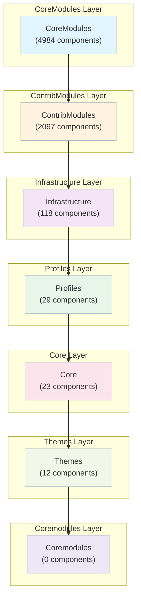

# Drupal - Complete C4 Architecture Documentation
**Generated by Flowscribe**  
**Date:** 2025-10-15  
**Analysis Cost:** $1.037  
**Total Components (Deptrac):** 7263  
**L4 Component Docs:** 10  
**Architecture Grade:** C+

---

## 📋 Table of Contents

1. [Quick Start](#quick-start)
2. [Documentation Levels](#documentation-levels)
3. [Architecture Overview](#architecture-overview)
4. [C4 Level 1: System Context](#c4-level-1-system-context)
5. [C4 Level 2: Containers](#c4-level-2-containers)
6. [C4 Level 3: Components](#c4-level-3-components)
7. [C4 Level 4: Code](#c4-level-4-code)
8. [Architecture Review](#architecture-review)
9. [Key Insights](#key-insights)
10. [Refactoring Priorities](#refactoring-priorities)
11. [How to Use This Documentation](#how-to-use-this-documentation)

---

## Quick Start

**Path 1: High-Level Overview (5 minutes)**
1. 📊 [C4 Level 1: System Context](./c4-level1.md) - Who uses it, what it connects to
2. 🗄️ [C4 Level 2: Containers](./c4-level2.md) - Major architectural layers
3. ⚡ Key insights below

**Path 2: Architecture Deep Dive (30 minutes)**
1. Start with Path 1 above
2. 🔍 [C4 Level 3: Components](#c4-level-3-components) - Pick a layer to explore
3. 💡 [C4 Level 4: Code Hub](./c4-level4.md) - Understand key components
4. 📋 [Architecture Review](./architecture-review.md) - Expert assessment and recommendations

**Path 3: Component-Focused**
1. 📚 [C4 Level 4: Code Hub](./c4-level4.md)
2. 🔬 Dive into specific component documentation
3. 🔄 Trace back to L3 and L2 for context

---

## Documentation Levels

| Level | Document | What It Shows | Audience | Status |
|------:|----------|---------------|----------|--------|
| **L1** | [System Context](./c4-level1.md) | Boundaries, users, externals | Everyone | ✅ |
| **L2** | [Containers](./c4-level2.md) | High-level architecture | Architects/Leads | ✅ |
| **L3** | [Components](#c4-level-3-components) | Components by layer | Devs/Architects | ✅ |
| **L4** | [Code](./c4-level4.md) | Code-level design | Sr Devs/Architects | ✅ |
| **Review** | [Architecture Review](./architecture-review.md) | Assessment + roadmap | Architects/Leads | ✅ |

---

## Architecture Overview

**Key Statistics**
- **Architectural Layers:** 7
- **Total Components (Deptrac):** 7263
- **L4 Component Docs:** 10
- **Architectural Violations:** 959670
- **Architecture Grade:** C+
- **Analysis Cost:** $1.037
- **Analysis Tokens:** 365,614

### Rich Layered Overview

### Layers
- **CoreModules:** 4984 components
- **ContribModules:** 2097 components
- **Infrastructure:** 118 components
- **Profiles:** 29 components
- **Core:** 23 components
- **Themes:** 12 components
- **Coremodules:** 0 components

### Layer Documentation
- **Core:** ✅ [L3 Documentation →](./c4-level3-core.md) — 23 components
- **Coremodules:** ✅ [L3 Documentation →](./c4-level3-coremodules.md) — 0 components
- **Infrastructure:** ✅ [L3 Documentation →](./c4-level3-infrastructure.md) — 118 components
- **Profiles:** ✅ [L3 Documentation →](./c4-level3-profiles.md) — 29 components
- **Themes:** ✅ [L3 Documentation →](./c4-level3-themes.md) — 12 components

---

## C4 Level 1: System Context
📄 **[Open L1 →](./c4-level1.md)** ✅

## C4 Level 2: Containers
📄 **[Open L2 →](./c4-level2.md)** ✅

## C4 Level 3: Components
_See layer links above_

## C4 Level 4: Code
📄 **[Open L4 Hub →](./c4-level4.md)** ✅

---

## Architecture Review
📋 **[Open Review →](./architecture-review.md)** ✅

### Executive Summary
Drupal presents a mature, plugin-based content management system with sophisticated infrastructure patterns, but suffers from severe architectural boundary violations that undermine its layered design. With 959,670 total violations and only 68% of dependencies properly allowed, the system exhibits classic symptoms of a monolithic architecture struggling to maintain separation of concerns despite having a well-defined layer structure.

The architecture demonstrates strong patterns in areas like plugin discovery, entity storage, and caching, but massive circular dependencies between CoreModules (238,493 self-references) and widespread Infrastructure contamination (223,263 violations from ContribModules to Infrastructure) suggest that the theoretical layering exists primarily in documentation rather than enforced practice. The Core layer contains 2,139 components with extensive coupling to upper layers, violating fundamental dependency inversion principles.

Despite these critical issues, Drupal's extensibility mechanisms, comprehensive test infrastructure integration, and sophisticated configuration management show the hallmarks of enterprise-grade CMS architecture. The challenge ahead is not redesigning the system, but establishing and enforcing the architectural boundaries that already exist on paper.

**Grade:** C+

---

## Analysis Metrics

**Total Cost:** $1.0372  
**Total Tokens:** 365,614  
**Total Time:** 2570.7s (42.8 minutes)

## 📊 Cost & Usage Summary

| Stage | Model | Cost (USD) | Tokens (in/out) | Duration (s) |
|-------|-------|-----------:|----------------:|-------------:|
| 🧭 C4 Level 1 - Context | x-ai/grok-code-fast-1 | $0.0019 | 2,224 / 984 | 11.0 |
| 🏗️ C4 Level 2 - Containers | none | $0.0000 | 0 / 0 | 19.9 |
| ⚙️ C4 Level 4 - Code | x-ai/grok-code-fast-1 | $0.0414 | 60,920 / 19,736 | 661.2 |
| 🧱 Architecture Review | anthropic/claude-sonnet-4.5 | $0.9939 | 269,363 / 12,387 | 236.7 |
| 💼 **TOTAL** |  | **$1.0372** | **332,507 / 33,107** | **928.8** |

_Legend: **in** = prompt tokens, **out** = completion tokens. All costs are from OpenRouter usage accounting._

_Note: No L3 analysis run for this repo._

_Footnote: Total time (2570.7s) includes non-LLM overhead (e.g., parsing, IO, prompt build). Per-stage durations sum to 928.8s; delta +1641.9s._

---

## Files
- `README.md` (this index)
- `c4-level1.md`, `c4-level2.md`, `c4-level4.md`, `architecture-review.md`
- `c4-level3-*.md` (per-layer components)
- `.c4-level*-metrics.json`, `.architecture-review-metrics.json`, `.flowscribe-metrics.json`

**Last Updated:** 2025-10-15 06:25:12
