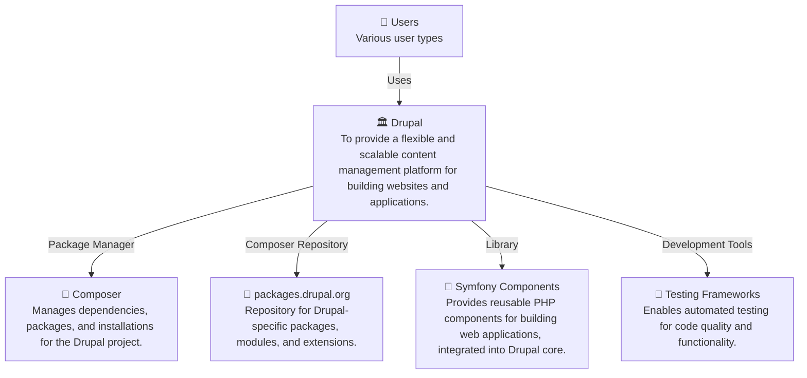

# Drupal - C4 Level 1: System Context

**Generated:** 2025-10-15 05:37:19  
**Domain:** content management  
**Diagram Level:** C4 Level 1 (System Context)

---

## System Overview

### Description
Drupal is an open source content management system built using PHP and managed via Composer, enabling the creation and management of websites and applications. It leverages various external libraries and frameworks for functionality, testing, and development. The system is designed for ease of extension through modules, themes, and recipes.

### Purpose
To provide a flexible and scalable content management platform for building websites and applications.

### Key Features
- Modular architecture with extendable modules and themes
- Composer-based dependency management for easy package installation
- Integrated testing tools for development and quality assurance
- Support for recipes and scaffolding to streamline site setup

---

## Users and Actors

### Content Editor

**Role:** A user responsible for creating, editing, and publishing content on a Drupal site.

**Primary Actions:**
- create content
- edit pages
- manage media

### Site Administrator

**Role:** A user overseeing the configuration, security, and maintenance of the Drupal site.

**Primary Actions:**
- configure site settings
- manage users and permissions
- install modules

### Developer

**Role:** A technical user who builds custom functionality, themes, and integrates extensions into the Drupal system.

**Primary Actions:**
- develop modules
- customize themes
- run tests

---

## External Systems and Integrations

### Composer

**Purpose:** Manages dependencies, packages, and installations for the Drupal project.

**Integration Type:** Package Manager

**Data Flow:** Downloads and installs required libraries, core components, and plugins based on composer.json specifications.

### packages.drupal.org

**Purpose:** Repository for Drupal-specific packages, modules, and extensions.

**Integration Type:** Composer Repository

**Data Flow:** Fetches contrib modules, profiles, and themes as specified in composer dependencies.

### Symfony Components

**Purpose:** Provides reusable PHP components for building web applications, integrated into Drupal core.

**Integration Type:** Library

**Data Flow:** Utilizes components like routing, HTTP foundation, and dependency injection within Drupal's framework.

### Testing Frameworks

**Purpose:** Enables automated testing for code quality and functionality.

**Integration Type:** Development Tools

**Data Flow:** Runs PHPUnit tests, Behat scenarios, and code analysis with tools like PHPStan and PHPCS.

---

## System Context Diagram

