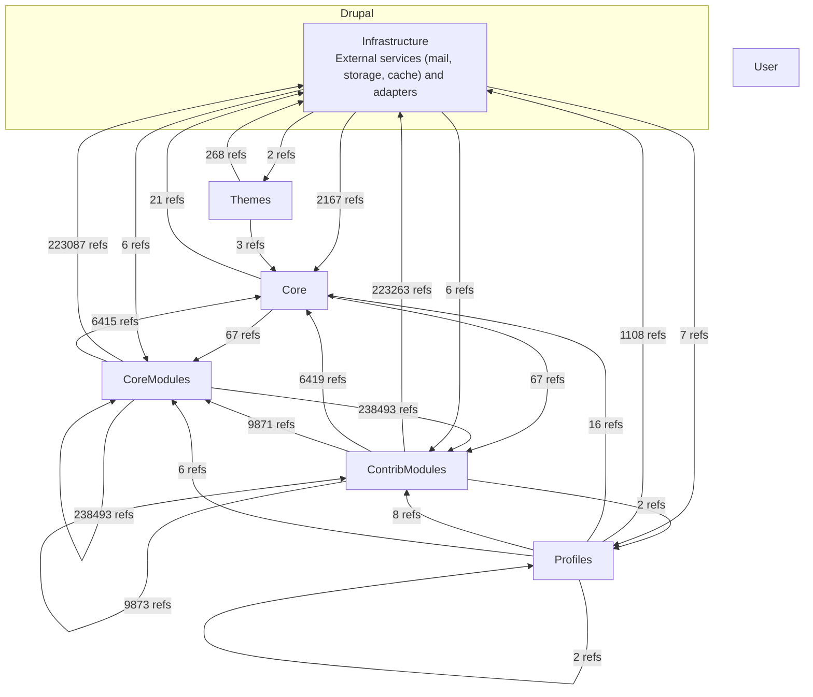

# Drupal - C4 Level 2: Container Architecture

**Generated:** 2025-10-15 05:37:35  
**Source:** Deptrac dependency analysis  
**Diagram Level:** C4 Level 2 (Containers)

---

## Container Diagram

---

## Architectural Violations ⚠️
- **Total**: 959670  •  **Unique layer pairs**: 24  •  **By rule (top)**: unknown ×959670
_Showing top 100 rows by count (of 959670 total). See `c4-level2-violations.json` for the full index._

| From Layer | To Layer | Count | Top files (sample) |
|---|---|---:|---|
| CoreModules | CoreModules | 238493 | drupal/core/modules/user/tests/src/Traits/UserCreationTrait.php ×32580, drupal/core/tests/Drupal/Tests/BrowserTestBase.php ×28476, drupal/core/modules/node/tests/src/Traits/ContentTypeCreationTrait.php ×15892 |
| CoreModules | ContribModules | 238493 | drupal/core/modules/user/tests/src/Traits/UserCreationTrait.php ×32580, drupal/core/tests/Drupal/Tests/BrowserTestBase.php ×28476, drupal/core/modules/node/tests/src/Traits/ContentTypeCreationTrait.php ×15892 |
| ContribModules | Infrastructure | 223263 | drupal/core/tests/Drupal/Tests/BrowserTestBase.php ×57000, drupal/core/tests/Drupal/KernelTests/KernelTestBase.php ×44009, drupal/core/tests/Drupal/TestTools/Extension/DeprecationBridge/ExpectDeprecationTrait.php ×38460 |
| CoreModules | Infrastructure | 223087 | drupal/core/tests/Drupal/Tests/BrowserTestBase.php ×56952, drupal/core/tests/Drupal/KernelTests/KernelTestBase.php ×43981, drupal/core/tests/Drupal/TestTools/Extension/DeprecationBridge/ExpectDeprecationTrait.php ×38424 |
| ContribModules | ContribModules | 9873 | drupal/core/modules/jsonapi/tests/src/Functional/ResourceTestBase.php ×2114, drupal/core/modules/package_manager/tests/src/Kernel/PackageManagerKernelTestBase.php ×951, drupal/core/modules/jsonapi/tests/src/Functional/ResourceResponseTestTrait.php ×918 |
| ContribModules | CoreModules | 9871 | drupal/core/modules/jsonapi/tests/src/Functional/ResourceTestBase.php ×2114, drupal/core/modules/package_manager/tests/src/Kernel/PackageManagerKernelTestBase.php ×951, drupal/core/modules/jsonapi/tests/src/Functional/ResourceResponseTestTrait.php ×918 |
| ContribModules | Core | 6419 | drupal/core/tests/Drupal/KernelTests/KernelTestBase.php ×2396, drupal/core/lib/Drupal/Core/Test/FunctionalTestSetupTrait.php ×1646, drupal/core/modules/rest/tests/src/Functional/EntityResource/EntityResourceTestBase.php ×596 |
| CoreModules | Core | 6415 | drupal/core/tests/Drupal/KernelTests/KernelTestBase.php ×2394, drupal/core/lib/Drupal/Core/Test/FunctionalTestSetupTrait.php ×1644, drupal/core/modules/rest/tests/src/Functional/EntityResource/EntityResourceTestBase.php ×596 |
| Infrastructure | Core | 2167 | drupal/core/tests/Drupal/KernelTests/KernelTestBase.php ×908, drupal/core/lib/Drupal/Core/Test/FunctionalTestSetupTrait.php ×224, drupal/core/modules/rest/tests/src/Functional/EntityResource/EntityResourceTestBase.php ×84 |
| Profiles | Infrastructure | 1108 | drupal/core/tests/Drupal/Tests/BrowserTestBase.php ×384, drupal/core/tests/Drupal/TestTools/Extension/DeprecationBridge/ExpectDeprecationTrait.php ×156, drupal/core/tests/Drupal/Tests/UiHelperTrait.php ×84 |
| Themes | Infrastructure | 268 | drupal/core/tests/Drupal/Tests/BrowserTestBase.php ×104, drupal/core/tests/Drupal/TestTools/Extension/DeprecationBridge/ExpectDeprecationTrait.php ×48, drupal/core/tests/Drupal/Tests/PhpUnitCompatibilityTrait.php ×24 |
| Core | CoreModules | 67 | drupal/core/lib/Drupal/Core/Entity/RevisionLogInterface.php ×12, drupal/core/lib/Drupal/Core/DefaultContent/Importer.php ×8, drupal/core/lib/Drupal/Core/Entity/Form/WorkspaceSafeFormTrait.php ×8 |
| Core | ContribModules | 67 | drupal/core/lib/Drupal/Core/Entity/RevisionLogInterface.php ×12, drupal/core/lib/Drupal/Core/DefaultContent/Importer.php ×8, drupal/core/lib/Drupal/Core/Entity/Form/WorkspaceSafeFormTrait.php ×8 |
| Core | Infrastructure | 21 | drupal/core/lib/Drupal/Core/Test/JUnitConverter.php ×9, drupal/core/lib/Drupal/Component/DependencyInjection/Dumper/OptimizedPhpArrayDumper.php ×4, drupal/core/lib/Drupal/Core/Composer/Composer.php ×2 |
| Profiles | Core | 16 | drupal/core/lib/Drupal/Core/Test/FunctionalTestSetupTrait.php ×12, drupal/core/tests/Drupal/KernelTests/KernelTestBase.php ×2, drupal/core/profiles/demo_umami/src/Hook/DemoUmamiRequirements.php ×2 |
| Profiles | ContribModules | 8 | drupal/core/profiles/standard/tests/src/Traits/StandardTestTrait.php ×4, drupal/core/profiles/demo_umami/modules/demo_umami_content/src/Hook/DemoUmamiContentHooks.php ×2, drupal/core/profiles/demo_umami/tests/src/Functional/DemoUmamiProfileTest.php ×2 |
| Infrastructure | Profiles | 7 | drupal/core/profiles/standard/tests/src/Functional/StandardTest.php ×3, drupal/core/tests/Drupal/FunctionalTests/Core/Recipe/StandardRecipeInstallTest.php ×2, drupal/core/tests/Drupal/FunctionalTests/Core/Recipe/StandardRecipeTest.php ×2 |
| Profiles | CoreModules | 6 | drupal/core/profiles/standard/tests/src/Traits/StandardTestTrait.php ×4, drupal/core/profiles/demo_umami/tests/src/Functional/DemoUmamiProfileTest.php ×2 |
| Infrastructure | CoreModules | 6 | drupal/core/profiles/standard/tests/src/Traits/StandardTestTrait.php ×4, drupal/core/tests/Drupal/KernelTests/Core/Entity/EntityDisplayFormBaseTest.php ×2 |
| Infrastructure | ContribModules | 6 | drupal/core/profiles/standard/tests/src/Traits/StandardTestTrait.php ×4, drupal/core/tests/Drupal/KernelTests/Core/Entity/EntityDisplayFormBaseTest.php ×2 |
| Themes | Core | 3 | drupal/core/lib/Drupal/Core/Test/FunctionalTestSetupTrait.php ×3 |
| ContribModules | Profiles | 2 | drupal/core/profiles/demo_umami/modules/demo_umami_content/src/Hook/DemoUmamiContentHooks.php ×2 |
| Profiles | Profiles | 2 | drupal/core/profiles/demo_umami/modules/demo_umami_content/src/Hook/DemoUmamiContentHooks.php ×2 |
| Infrastructure | Themes | 2 | drupal/core/tests/Drupal/Tests/Core/Theme/CoreThemesAutoloadedForTestsTest.php ×2 |

---

## Next Steps
1. **Review L3 (Component View)** - Detailed component analysis per layer
2. **Address Violations** - Fix architectural rule violations
3. **Refactor** - Improve layer separation based on findings
4. **Document** - Keep architecture documentation updated

*Generated by Flowscribe - Automated C4 Architecture Documentation*