# Drupal - Infrastructure Layer (C4 Level 3)

**Generated:** 2025-10-15 06:09:59  
**Layer:** Infrastructure  
**Components:** 50  
**Source:** Deptrac dependency analysis

---

## Component Diagram

```mermaid
graph TB
    subgraph "Infrastructure Layer"
        subgraph "Other Infrastructure"
            db_tools[db-tools]
            dump_database_d8_mysql[dump-database-d8-mysql]
            generate_proxy_class[generate-proxy-class]
            PackageManagerFixtureCreator[PackageManagerFixtureCreator]
            Composer[Composer]
            BuilderInterface[BuilderInterface]
            ComponentGenerator[ComponentGenerator]
            PackageGenerator[PackageGenerator]
            DrupalCoreRecommendedBuilder[DrupalCoreRecommendedBuilder]
            DrupalDevDependenciesBuilder[DrupalDevDependenciesBuilder]
            DrupalPackageBuilder[DrupalPackageBuilder]
            DrupalPinnedDevDependenciesBuilder[DrupalPinnedDevDependenciesBuilder]
            DrupalCoreComposer[DrupalCoreComposer]
            Message[Message]
            MessagePlugin[MessagePlugin]
            CommandProvider[CommandProvider]
            Plugin[Plugin]
            RootComposer[RootComposer]
            SemVer[SemVer]
            UnpackCollection[UnpackCollection]
            UnpackCommand[UnpackCommand]
            Unpacker[Unpacker]
            UnpackManager[UnpackManager]
            UnpackOptions[UnpackOptions]
            AllowedPackages[AllowedPackages]
            ComposerScaffoldCommand[ComposerScaffoldCommand]
            DrupalInstalledTemplate[DrupalInstalledTemplate]
            Git[Git]
            Handler[Handler]
            Interpolator[Interpolator]
            ManageGitIgnore[ManageGitIgnore]
            ManageOptions[ManageOptions]
            PostPackageEventListenerInterface[PostPackageEventListenerInterface]
            ScaffoldOptions[ScaffoldOptions]
            AbstractOperation[AbstractOperation]
            AppendOp[AppendOp]
            OperationData[OperationData]
            OperationFactory[OperationFactory]
            OperationInterface[OperationInterface]
            ReplaceOp[ReplaceOp]
            ScaffoldResult[ScaffoldResult]
            SkipOp[SkipOp]
            Config[Config]
            VendorHardeningPlugin[VendorHardeningPlugin]
            SemanticVersion[SemanticVersion]
        end
        subgraph "File Management"
            GenerateAutoloadReferenceFile[GenerateAutoloadReferenceFile]
            ScaffoldFileInfo[ScaffoldFileInfo]
            ScaffoldFilePath[ScaffoldFilePath]
            ScaffoldFileCollection[ScaffoldFileCollection]
            FileSecurity[FileSecurity]
        end
    end

    %% Component Dependencies

    %% External Layer Dependencies
    Themes[Themes Layer]
    Profiles[Profiles Layer]
    CoreModules[CoreModules Layer]
    Core[Core Layer]
    ContribModules[ContribModules Layer]
FunctionalTestSetupTrait -.-> Core
FunctionalTestSetupTrait -.-> Core
FunctionalTestSetupTrait -.-> Core
FunctionalTestSetupTrait -.-> Core
FunctionalTestSetupTrait -.-> Core
FunctionalTestSetupTrait -.-> Core
FunctionalTestSetupTrait -.-> Core
FunctionalTestSetupTrait -.-> Core
FunctionalTestSetupTrait -.-> Core
FunctionalTestSetupTrait -.-> Core
    %% ... and 2178 more external dependencies
```

---

## Component List

### Other Infrastructure

#### AbstractOperation

**Purpose:** AbstractOperation component

**File:** `AbstractOperation.php`

**Architectural Issues:** 1 violations detected

---

#### AllowedPackages

**Purpose:** AllowedPackages component

**File:** `AllowedPackages.php`

**Architectural Issues:** 1 violations detected

---

#### AppendOp

**Purpose:** AppendOp component

**File:** `AppendOp.php`

**Architectural Issues:** 1 violations detected

---

#### BuilderInterface

**Purpose:** BuilderInterface component

**File:** `BuilderInterface.php`

**Architectural Issues:** 1 violations detected

---

#### CommandProvider

**Purpose:** CommandProvider component

**File:** `CommandProvider.php`

**Architectural Issues:** 2 violations detected

---

#### ComponentGenerator

**Purpose:** ComponentGenerator component

**File:** `ComponentGenerator.php`

**Architectural Issues:** 1 violations detected

---

#### Composer

**Purpose:** Composer component

**File:** `Composer.php`

**Architectural Issues:** 1 violations detected

---

#### ComposerScaffoldCommand

**Purpose:** ComposerScaffoldCommand component

**File:** `ComposerScaffoldCommand.php`

**Architectural Issues:** 1 violations detected

---

#### Config

**Purpose:** Config component

**File:** `Config.php`

**Architectural Issues:** 1 violations detected

---

#### DrupalCoreComposer

**Purpose:** DrupalCoreComposer component

**File:** `DrupalCoreComposer.php`

**Architectural Issues:** 1 violations detected

---

#### DrupalCoreRecommendedBuilder

**Purpose:** DrupalCoreRecommendedBuilder component

**File:** `DrupalCoreRecommendedBuilder.php`

**Architectural Issues:** 1 violations detected

---

#### DrupalDevDependenciesBuilder

**Purpose:** DrupalDevDependenciesBuilder component

**File:** `DrupalDevDependenciesBuilder.php`

**Architectural Issues:** 1 violations detected

---

#### DrupalInstalledTemplate

**Purpose:** DrupalInstalledTemplate component

**File:** `DrupalInstalledTemplate.php`

**Architectural Issues:** 1 violations detected

---

#### DrupalPackageBuilder

**Purpose:** DrupalPackageBuilder component

**File:** `DrupalPackageBuilder.php`

**Architectural Issues:** 1 violations detected

---

#### DrupalPinnedDevDependenciesBuilder

**Purpose:** DrupalPinnedDevDependenciesBuilder component

**File:** `DrupalPinnedDevDependenciesBuilder.php`

**Architectural Issues:** 1 violations detected

---

#### Git

**Purpose:** Git component

**File:** `Git.php`

**Architectural Issues:** 1 violations detected

---

#### Handler

**Purpose:** Handles requests for 

**File:** `Handler.php`

**Architectural Issues:** 1 violations detected

---

#### Interpolator

**Purpose:** Interpolator component

**File:** `Interpolator.php`

**Architectural Issues:** 1 violations detected

---

#### ManageGitIgnore

**Purpose:** ManageGitIgnore component

**File:** `ManageGitIgnore.php`

**Architectural Issues:** 1 violations detected

---

#### ManageOptions

**Purpose:** ManageOptions component

**File:** `ManageOptions.php`

**Architectural Issues:** 1 violations detected

---

#### Message

**Purpose:** Message component

**File:** `Message.php`

**Architectural Issues:** 1 violations detected

---

#### MessagePlugin

**Purpose:** MessagePlugin component

**File:** `MessagePlugin.php`

**Architectural Issues:** 1 violations detected

---

#### OperationData

**Purpose:** OperationData component

**File:** `OperationData.php`

**Architectural Issues:** 1 violations detected

---

#### OperationFactory

**Purpose:** OperationFactory component

**File:** `OperationFactory.php`

**Architectural Issues:** 1 violations detected

---

#### OperationInterface

**Purpose:** OperationInterface component

**File:** `OperationInterface.php`

**Architectural Issues:** 1 violations detected

---

#### PackageGenerator

**Purpose:** PackageGenerator component

**File:** `PackageGenerator.php`

**Architectural Issues:** 1 violations detected

---

#### PackageManagerFixtureCreator

**Purpose:** Manages PackageFixtureCreator operations

**File:** `PackageManagerFixtureCreator.php`

**Architectural Issues:** 1 violations detected

---

#### Plugin

**Purpose:** Plugin component

**File:** `Plugin.php`

**Architectural Issues:** 2 violations detected

---

#### PostPackageEventListenerInterface

**Purpose:** PostPackageEventListenerInterface component

**File:** `PostPackageEventListenerInterface.php`

**Architectural Issues:** 1 violations detected

---

#### ReplaceOp

**Purpose:** ReplaceOp component

**File:** `ReplaceOp.php`

**Architectural Issues:** 1 violations detected

---

#### RootComposer

**Purpose:** RootComposer component

**File:** `RootComposer.php`

**Architectural Issues:** 1 violations detected

---

#### ScaffoldOptions

**Purpose:** ScaffoldOptions component

**File:** `ScaffoldOptions.php`

**Architectural Issues:** 1 violations detected

---

#### ScaffoldResult

**Purpose:** ScaffoldResult component

**File:** `ScaffoldResult.php`

**Architectural Issues:** 1 violations detected

---

#### SemVer

**Purpose:** SemVer component

**File:** `SemVer.php`

**Architectural Issues:** 1 violations detected

---

#### SemanticVersion

**Purpose:** SemanticVersion component

**File:** `SemanticVersion.php`

**Architectural Issues:** 1 violations detected

---

#### SkipOp

**Purpose:** SkipOp component

**File:** `SkipOp.php`

**Architectural Issues:** 1 violations detected

---

#### UnpackCollection

**Purpose:** UnpackCollection component

**File:** `UnpackCollection.php`

**Architectural Issues:** 1 violations detected

---

#### UnpackCommand

**Purpose:** UnpackCommand component

**File:** `UnpackCommand.php`

**Architectural Issues:** 1 violations detected

---

#### UnpackManager

**Purpose:** Manages Unpack operations

**File:** `UnpackManager.php`

**Architectural Issues:** 1 violations detected

---

#### UnpackOptions

**Purpose:** UnpackOptions component

**File:** `UnpackOptions.php`

**Architectural Issues:** 1 violations detected

---

#### Unpacker

**Purpose:** Unpacker component

**File:** `Unpacker.php`

**Architectural Issues:** 1 violations detected

---

#### VendorHardeningPlugin

**Purpose:** VendorHardeningPlugin component

**File:** `VendorHardeningPlugin.php`

**Architectural Issues:** 1 violations detected

---

#### db-tools

**Purpose:** db-tools component

**File:** `db-tools.php`

**Architectural Issues:** 1 violations detected

---

#### dump-database-d8-mysql

**Purpose:** dump-database-d8-mysql component

**File:** `dump-database-d8-mysql.php`

**Architectural Issues:** 1 violations detected

---

#### generate-proxy-class

**Purpose:** generate-proxy-class component

**File:** `generate-proxy-class.php`

**Architectural Issues:** 1 violations detected

---

### File Management

#### FileSecurity

**Purpose:** FileSecurity component

**File:** `FileSecurity.php`

**Architectural Issues:** 1 violations detected

---

#### GenerateAutoloadReferenceFile

**Purpose:** GenerateAutoloadReferenceFile component

**File:** `GenerateAutoloadReferenceFile.php`

**Architectural Issues:** 1 violations detected

---

#### ScaffoldFileCollection

**Purpose:** ScaffoldFileCollection component

**File:** `ScaffoldFileCollection.php`

**Architectural Issues:** 1 violations detected

---

#### ScaffoldFileInfo

**Purpose:** ScaffoldFileInfo component

**File:** `ScaffoldFileInfo.php`

**Architectural Issues:** 1 violations detected

---

#### ScaffoldFilePath

**Purpose:** ScaffoldFilePath component

**File:** `ScaffoldFilePath.php`

**Architectural Issues:** 1 violations detected

---

## Statistics

- **Total Components:** 50
- **Component Categories:** 2
- **Internal Dependencies:** 0
- **External Dependencies:** 2188

---

## Analysis Notes

⚠️ **Basic Component Analysis**

This is a basic component-level analysis extracted from Deptrac violations. For enhanced analysis with:
- Better component descriptions
- Intelligent grouping
- Architectural pattern detection
- Business context
- Refactoring recommendations

Use the LLM-enhanced version: `llm-enhancer.py --enhance-components`

---

*Component diagram generated from Deptrac dependency analysis*
