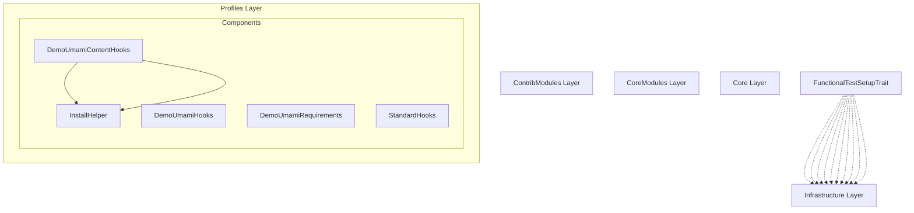

# Drupal - Profiles Layer (C4 Level 3)

**Generated:** 2025-10-15 06:03:40  
**Layer:** Profiles  
**Components:** 5  
**Source:** Deptrac dependency analysis

---

## Component Diagram

---

## Component List

### Components

#### DemoUmamiContentHooks

**Purpose:** DemoUmamiContentHooks component

**File:** `DemoUmamiContentHooks.php`

**Architectural Issues:** 1 violations detected

---

#### DemoUmamiHooks

**Purpose:** DemoUmamiHooks component

**File:** `DemoUmamiHooks.php`

**Architectural Issues:** 1 violations detected

---

#### DemoUmamiRequirements

**Purpose:** DemoUmamiRequirements component

**File:** `DemoUmamiRequirements.php`

**Architectural Issues:** 1 violations detected

---

#### InstallHelper

**Purpose:** InstallHelper component

**File:** `InstallHelper.php`

**Architectural Issues:** 1 violations detected

---

#### StandardHooks

**Purpose:** StandardHooks component

**File:** `StandardHooks.php`

**Architectural Issues:** 1 violations detected

---

## Statistics

- **Total Components:** 5
- **Component Categories:** 1
- **Internal Dependencies:** 2
- **External Dependencies:** 1138

---

## Analysis Notes

⚠️ **Basic Component Analysis**

This is a basic component-level analysis extracted from Deptrac violations. For enhanced analysis with:
- Better component descriptions
- Intelligent grouping
- Architectural pattern detection
- Business context
- Refactoring recommendations

Use the LLM-enhanced version: `llm-enhancer.py --enhance-components`

---

*Component diagram generated from Deptrac dependency analysis*
