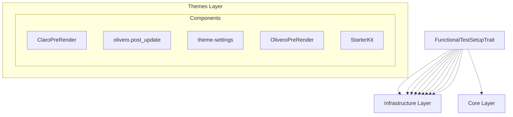

# Drupal - Themes Layer (C4 Level 3)

**Generated:** 2025-10-15 05:57:54  
**Layer:** Themes  
**Components:** 5  
**Source:** Deptrac dependency analysis

---

## Component Diagram

---

## Component List

### Components

#### ClaroPreRender

**Purpose:** ClaroPreRender component

**File:** `ClaroPreRender.php`

**Architectural Issues:** 1 violations detected

---

#### OliveroPreRender

**Purpose:** OliveroPreRender component

**File:** `OliveroPreRender.php`

**Architectural Issues:** 1 violations detected

---

#### StarterKit

**Purpose:** StarterKit component

**File:** `StarterKit.php`

**Architectural Issues:** 1 violations detected

---

#### olivero.post_update

**Purpose:** olivero.post_update component

**File:** `olivero.post_update.php`

**Architectural Issues:** 1 violations detected

---

#### theme-settings

**Purpose:** theme-settings component

**File:** `theme-settings.php`

**Architectural Issues:** 1 violations detected

---

## Statistics

- **Total Components:** 5
- **Component Categories:** 1
- **Internal Dependencies:** 0
- **External Dependencies:** 271

---

## Analysis Notes

⚠️ **Basic Component Analysis**

This is a basic component-level analysis extracted from Deptrac violations. For enhanced analysis with:
- Better component descriptions
- Intelligent grouping
- Architectural pattern detection
- Business context
- Refactoring recommendations

Use the LLM-enhanced version: `llm-enhancer.py --enhance-components`

---

*Component diagram generated from Deptrac dependency analysis*
