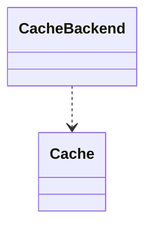

# Drupal - C4 Level 4: CacheBackend

**Generated:** 2025-10-15 06:20:00  
**Type:** Other  
**File:** `core/lib/Drupal/Core/Cache/CacheBackendInterface.php`

---

## Component Overview

### Purpose
Defines an interface for cache implementations in Drupal, ensuring consistent caching operations across different backends to optimize performance for content-heavy applications.

### Responsibility
Provide a standardized contract for persistent caching, allowing retrieval, storage, invalidation, and deletion of cached data.

### Design Patterns
- Strategy

---

## Public Interface

```php
public get($cid, $allow_invalid = FALSE)
public getMultiple(&$cids, $allow_invalid = FALSE)
public set($cid, $data, $expire = Cache::PERMANENT, array $tags = [])
public setMultiple(array $items)
public delete($cid)
public deleteMultiple(array $cids)
public deleteAll()
public invalidate($cid)
public invalidateMultiple(array $cids)
public invalidateAll()
public garbageCollection()
public removeBin()
```

---

## Key Methods

### `get()`

**Purpose:** Retrieves a single cache item by ID, optionally allowing invalid items.

**Parameters:** `(string $cid, bool $allow_invalid = FALSE)`

**Returns:** `object|false`

**Complexity:** Simple

### `set()`

**Purpose:** Stores a single cache item with data, expiration, and tags.

**Parameters:** `(string $cid, mixed $data, int $expire = Cache::PERMANENT, array $tags = [])`

**Returns:** `void`

**Complexity:** Simple

### `delete()`

**Purpose:** Permanently removes a cache item by ID.

**Parameters:** `(string $cid)`

**Returns:** `void`

**Complexity:** Simple

### `invalidate()`

**Purpose:** Marks a cache item as invalid, allowing retrieval if allowed.

**Parameters:** `(string $cid)`

**Returns:** `void`

**Complexity:** Simple

### `garbageCollection()`

**Purpose:** Performs cleanup by removing expired or invalid cache items.

**Parameters:** `()`

**Returns:** `void`

**Complexity:** Moderate

---

## Dependencies



**Dependency Details:**

- **Cache** (class) - references

---

## Internal State

*No internal state documented*

---

## Key Algorithms

*No complex algorithms identified*

---

## Integration Points

- Implementations like DatabaseBackend for storage in database
- Cache tags system for invalidation based on entity updates
- Other Drupal components for caching rendered pages, entities, and query results

---

## Architectural Notes

Employs the Strategy pattern to allow pluggable cache backends, supporting tag-based invalidation for fine-grained cache management. Constants like CACHE_PERMANENT ensure consistent expiration handling across implementations. The invalidate versus delete distinction allows graceful handling of stale data in concurrent scenarios.

---

*Generated by Flowscribe - Automated C4 Architecture Documentation*
