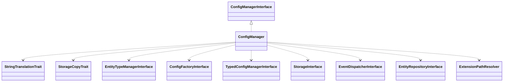

# Drupal - C4 Level 4: ConfigManager

**Generated:** 2025-10-15 06:21:01  
**Type:** Service  
**File:** `core/lib/Drupal/Core/Config/ConfigManager.php`

---

## Component Overview

### Purpose
Manages Drupal's configuration system by providing utilities for loading, differentiating, and uninstalling configuration entities, ensuring version-controlled consistency across deployments.

### Responsibility
 Serves as a central service for configuration operations, handling dependencies, diffs, and lifecycle management without direct storage manipulation.

### Design Patterns
- Service
- Dependency Injection
- Composition (via Traits)

---

## Public Interface

```php
public getEntityTypeIdByName($name)
public loadConfigEntityByName($name)
public getEntityTypeManager()
public getConfigFactory()
public diff(StorageInterface $source_storage, StorageInterface $target_storage, $source_name, $target_name = null, $collection = StorageInterface::DEFAULT_COLLECTION)
public createSnapshot(StorageInterface $source_storage, StorageInterface $snapshot_storage)
public uninstall($type, $name)
public getConfigDependencyManager()
public findConfigEntityDependencies($type, array $names, ?ConfigDependencyManager $dependency_manager = null)
public findConfigEntityDependenciesAsEntities($type, array $names, ?ConfigDependencyManager $dependency_manager = null)
public getConfigEntitiesToChangeOnDependencyRemoval($type, array $names, $dry_run = true)
public getConfigCollectionInfo()
public findMissingContentDependencies()
```

---

## Key Methods

### `getEntityTypeIdByName()`

**Purpose:** Determines the entity type ID from a configuration name by checking config prefixes.

**Parameters:** `string $name`

**Returns:** `string|null`

**Complexity:** Simple

### `loadConfigEntityByName()`

**Purpose:** Loads a config entity by its full name, extracting the ID from the config prefix.

**Parameters:** `string $name`

**Returns:** `ConfigEntityInterface|null`

**Complexity:** Simple

### `diff()`

**Purpose:** Computes differences between source and target configurations for a given name.

**Parameters:** `StorageInterface $source_storage, StorageInterface $target_storage, string $source_name, string $target_name = null, string $collection = StorageInterface::DEFAULT_COLLECTION`

**Returns:** `Diff`

**Complexity:** Moderate

### `createSnapshot()`

**Purpose:** Creates a snapshot of configuration from source storage to snapshot storage.

**Parameters:** `StorageInterface $source_storage, StorageInterface $snapshot_storage`

**Returns:** `void`

**Complexity:** Simple

### `uninstall()`

**Purpose:** Uninstalls a module or theme by managing dependent configurations, deletions, and schema cache refresh.

**Parameters:** `string $type, string $name`

**Returns:** `void`

**Complexity:** Complex

### `getConfigDependencyManager()`

**Purpose:** Creates and returns a ConfigDependencyManager with current config data for dependency resolution.

**Parameters:** `none`

**Returns:** `ConfigDependencyManager`

**Complexity:** Moderate

### `findConfigEntityDependencies()`

**Purpose:** Finds dependent entities for given types and names using a dependency manager.

**Parameters:** `string $type, array $names, ConfigDependencyManager $dependency_manager = null`

**Returns:** `array`

**Complexity:** Moderate

### `getConfigEntitiesToChangeOnDependencyRemoval()`

**Purpose:** Calculates which config entities need updates or deletions when dependencies are removed, supporting dry runs.

**Parameters:** `string $type, array $names, bool $dry_run = true`

**Returns:** `array`

**Complexity:** Complex

### `callOnDependencyRemoval()`

**Purpose:** Helper to invoke onDependencyRemoval on entities, preparing affected dependencies.

**Parameters:** `ConfigEntityInterface $entity, array $dependent_entities, string $type, array $names`

**Returns:** `bool`

**Complexity:** Moderate

### `findMissingContentDependencies()`

**Purpose:** Identifies content dependencies that are missing from configurations.

**Parameters:** `none`

**Returns:** `array`

**Complexity:** Moderate

---

## Dependencies



**Dependency Details:**

- **ConfigManagerInterface** (interface) - implements
- **StringTranslationTrait** (trait) - uses
- **StorageCopyTrait** (trait) - uses
- **EntityTypeManagerInterface** (class) - injects
- **ConfigFactoryInterface** (interface) - injects
- **TypedConfigManagerInterface** (interface) - injects
- **StorageInterface** (interface) - injects
- **EventDispatcherInterface** (interface) - injects
- **EntityRepositoryInterface** (interface) - injects
- **ExtensionPathResolver** (class) - injects

---

## Internal State

- `$entityTypeManager: EntityTypeManagerInterface - Manages entity types for loading and operations`
- `$entityRepository: EntityRepositoryInterface - Handles entity loading by UUID or config target`
- `$configFactory: ConfigFactoryInterface - Factory for config objects`
- `$typedConfigManager: TypedConfigManagerInterface - Manages typed configuration`
- `$activeStorage: StorageInterface - Storage for active configurations`
- `$eventDispatcher: EventDispatcherInterface - Dispatches events for collections`
- `$configCollectionInfo: ConfigCollectionInfo - Information about config collections`
- `$storages: array - Array of storages keyed by collection name`
- `$extensionPathResolver: ExtensionPathResolver - Resolves paths for extensions`

---

## Key Algorithms

### Dependency Resolution

In getConfigEntitiesToChangeOnDependencyRemoval and related methods, it calculates affected entities by simulating dependency graph changes, processing entities in dependency order to fix or delete them, ensuring safe dependency removal in complex scenarios.


---

## Integration Points

- Configuration Storages (for reading/writing config data)
- Entity Type Manager (for entity definitions and storages)
- Entity Repository (for loading entities by UUID)
- Event Dispatcher (for config collection events)
- Typed Config Manager (for schema definitions)

---

## Architectural Notes

Uses dependency injection for flexibility and testability, employs traits for code reuse, and integrates events for extensibility in config collections. The class centralizes config management to avoid tight coupling with storages or entities, ensuring operations are atomic and dependency-aware for multi-environment deployments.

---

*Generated by Flowscribe - Automated C4 Architecture Documentation*
