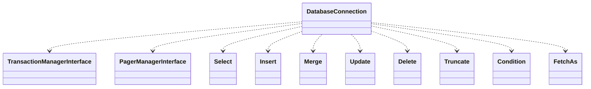

# Drupal - C4 Level 4: DatabaseConnection

**Generated:** 2025-10-15 06:20:14  
**Type:** Other  
**File:** `core/lib/Drupal/Core/Database/Connection.php`

---

## Component Overview

### Purpose
Provides an abstract base class for database connections in Drupal, enabling unified access to various database backends such as MySQL or PostgreSQL. It handles query preparation, execution, and result handling while abstracting driver-specific details.

### Responsibility
Serves as the core abstraction layer for establishing, managing, and interacting with database connections, ensuring database independence and portability across Drupal sites.

### Design Patterns
- Template Method
- Adapter
- Factory

---

## Public Interface

```php
public query($query, array $args = [], $options = [])
public select($table, $alias = NULL, array $options = [])
public insert($table, array $options = [])
public merge($table, array $options = [])
public update($table, array $options = [])
public delete($table, array $options = [])
public truncate($table, array $options = [])
public prepareStatement(string $query, array $options, bool $allow_row_count = FALSE)
public getClientConnection()
public getConnectionOptions()
public getPrefix()
public setTarget($target = NULL)
public getTarget()
public setKey($key)
public getKey()
public setLogger(Log $logger)
public getLogger()
public attachDatabase(string $database)
public getDriverClass($class)
public exceptionHandler()
public lastInsertId(?string $name = NULL)
public commitAll()
```

---

## Key Methods

### `__construct()`

**Purpose:** Initializes the connection object with a client connection and options, setting up prefixes, identifiers, and driver classes.

**Parameters:** `object $connection, array $connection_options`

**Returns:** `void`

**Complexity:** Moderate

### `query()`

**Purpose:** Executes a SQL query against the database after preprocessing and preparation as a prepared statement.

**Parameters:** `string $query, array $args, array $options`

**Returns:** `StatementInterface|null`

**Complexity:** Complex

### `select()`

**Purpose:** Prepares and returns a SELECT query object for building and executing select statements.

**Parameters:** `string|SelectInterface $table, string $alias, array $options`

**Returns:** `SelectInterface`

**Complexity:** Simple

### `insert()`

**Purpose:** Prepares and returns an INSERT query object for building insert statements.

**Parameters:** `string $table, array $options`

**Returns:** `Insert`

**Complexity:** Simple

### `prepareStatement()`

**Purpose:** Creates a prepared statement from a SQL query string, handling preprocessing like table prefixing and identifier quoting.

**Parameters:** `string $query, array $options, bool $allow_row_count`

**Returns:** `StatementInterface`

**Complexity:** Moderate

### `expandArguments()`

**Purpose:** Expands shorthand array placeholders in queries into individual placeholders for execution.

**Parameters:** `string &$query, array &$args`

**Returns:** `bool`

**Complexity:** Moderate

### `prefixTables()`

**Purpose:** Replaces table placeholders in SQL with prefixed names to support multiple sites in one database.

**Parameters:** `string $sql`

**Returns:** `string`

**Complexity:** Simple

---

## Dependencies



**Dependency Details:**

- **TransactionManagerInterface** (interface) - injects
- **PagerManagerInterface** (interface) - injects
- **Select** (class) - uses
- **Insert** (class) - uses
- **Merge** (class) - uses
- **Update** (class) - uses
- **Delete** (class) - uses
- **Truncate** (class) - uses
- **Condition** (class) - uses
- **FetchAs** (enum) - uses
- **Assertion** (trait) - uses

---

## Internal State

- `$target: string|null - The database target for logging and auditing`
- `$key: string|null - The unique key identifying the database connection`
- `$logger: Log|null - The logging object for database operations`
- `$driverClasses: array - Index of driver-specific classes`
- `$statementWrapperClass: string|null - Class name for statement wrapper`
- `$transactionalDDLSupport: bool - Whether DDL support transactional operations`
- `$connection: object - The underlying client connection object`
- `$connectionOptions: array - Connection configuration options`
- `$schema: Schema|null - The schema object for the connection`
- `$prefix: string - Table prefix for the connection`
- `$tablePlaceholderReplacements: array - Replacements for table placeholders`
- `$escapedTables: array - Cache of escaped table names`
- `$escapedFields: array - Cache of escaped field names`
- `$escapedAliases: array - Cache of escaped alias names`
- `$identifierQuotes: array - Quote characters for database identifiers`
- `$enabledEvents: array - Tracked database API events`
- `$transactionManager: TransactionManagerInterface - Manages transactions`

---

## Key Algorithms

### Query Preprocessing and Placeholder Expansion

Handles expansion of array placeholders, table prefixing, and identifier quoting to secure and adapt queries for the specific database driver, ensuring compatibility and preventing SQL injection.


---

## Integration Points

- Client database connections like PDO for MySQL, PostgreSQL, or SQLite
- Drupal's Query builders (Select, Insert, etc.) for constructing database operations
- TransactionManager for handling database transactions
- ExceptionHandler for managing database errors
- External logging systems via Log interface

---

## Architectural Notes

This abstract class promotes loose coupling between Drupal's application logic and underlying databases by providing a common interface, with concrete implementations delegating driver-specific behavior. It emphasizes security through prepared statements and sanitization, while supporting features like table prefixing for multi-tenancy. Subclasses must override the open() method to establish connections, enabling extensibility for various backends without altering the core API.

---

*Generated by Flowscribe - Automated C4 Architecture Documentation*
