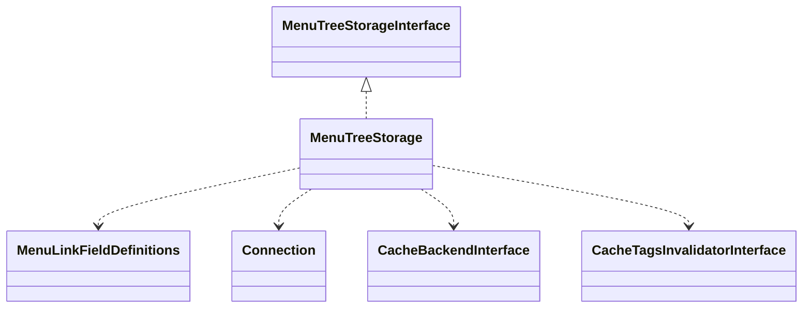

# Drupal - C4 Level 4: MenuTreeStorage

**Generated:** 2025-10-15 06:20:39  
**Type:** DAO  
**File:** `core/lib/Drupal/Core/Menu/MenuTreeStorage.php`

---

## Component Overview

### Purpose
Manages the storage, retrieval, and manipulation of menu tree hierarchies in Drupal, providing database-backed operations for menu links and enabling navigation workflows in content management systems.

### Responsibility
To encapsulate database operations for menu link hierarchies, including tree building, caching, and maintenance of parent-child relationships.

### Design Patterns
- Repository
- Materialized Path

---

## Public Interface

```php
public maxDepth()
public resetDefinitions()
public rebuild(array $definitions)
public save(array $link)
public delete($id)
public getSubtreeHeight($id)
public loadByProperties(array $properties)
public loadByRoute($route_name, array $route_parameters = [], $menu_name = NULL)
public loadMultiple(array $ids)
public load($id)
public getRootPathIds($id)
public getExpanded($menu_name, array $parents)
public loadTreeData($menu_name, MenuTreeParameters $parameters)
```

---

## Key Methods

### `rebuild()`

**Purpose:** Rebuilds the entire menu tree from a set of link definitions, handling parent-child relationships, orphans, and purging stale links.

**Parameters:** `array $definitions - Array of plugin definitions for menu links`

**Returns:** `void`

**Complexity:** Complex

### `save()`

**Purpose:** Persists a menu link definition to the database, updating caches and cache tags, and handling affected menus.

**Parameters:** `array $link - Menu link definition`

**Returns:** `array - Affected menu names`

**Complexity:** Moderate

### `delete()`

**Purpose:** Removes a menu link and re-attaches its children to the parent, updating parental status and caches.

**Parameters:** `string $id - Menu link ID`

**Returns:** `void`

**Complexity:** Moderate

### `loadTreeData()`

**Purpose:** Loads and caches flattened tree data for a menu, applying parameters to filter links, and building hierarchical information.

**Parameters:** `string $menu_name, MenuTreeParameters $parameters - Menu name and loading parameters`

**Returns:** `array - Tree data including links and route names`

**Complexity:** Complex

### `loadByProperties()`

**Purpose:** Loads menu links matching specified properties, filtering by allowed definition fields.

**Parameters:** `array $properties - Associative array of property name-value pairs`

**Returns:** `array - Array of loaded menu link definitions`

**Complexity:** Simple

---

## Dependencies



**Dependency Details:**

- **MenuTreeStorageInterface** (interface) - implements
- **MenuLinkFieldDefinitions** (trait) - uses
- **Connection** (class) - injects
- **CacheBackendInterface** (interface) - injects
- **CacheTagsInvalidatorInterface** (interface) - injects

---

## Internal State

- `$connection: Connection - Database connection for executing queries`
- `$menuCacheBackend: CacheBackendInterface - Cache backend for storing extracted tree data`
- `$cacheTagsInvalidator: CacheTagsInvalidatorInterface - Service for invalidating cache tags`
- `$table: string - Database table name for storing menu data`
- `$options: array - Additional database connection options for queries`
- `$definitions: array - Cache of loaded plugin definitions, keyed by ID`

---

## Key Algorithms

### Materialized Path for Hierarchies

Uses parent fields (p1-p9) to represent the full path from root to node, enabling efficient tree queries and depth calculations without recursive traversals.

### Recursive Save for Tree Rebuilding

Recursively saves menu links depth-first during rebuild operations, ensuring tree consistency and handling orphans by adjusting parent relationships.

### Tree Data Building

Constructs a flattened, depth-first ordered array of menu links with active trail information, optimized for menu rendering and cached for performance.


---

## Integration Points

- Database layer via Drupal Core Connection class for CRUD operations on menu_tree table
- Cache system via CacheBackendInterface for storing and retrieving menu tree data
- Cache invalidation system via CacheTagsInvalidatorInterface for alerting configuration changes
- Menu system broadly through MenuTreeParameters and related classes for querying and tree manipulation

---

## Architectural Notes

Employs a DAO pattern to abstract database interactions for menu trees, limiting tree depth to 9 levels via materialized paths for query efficiency. Integrates tightly with Drupal's caching and configuration systems to ensure data consistency across rebuilds. Handles serialization/unserialization of complex fields to support rich link metadata.

---

*Generated by Flowscribe - Automated C4 Architecture Documentation*
