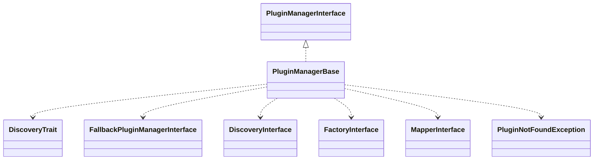

# Drupal - C4 Level 4: PluginManagerBase

**Generated:** 2025-10-15 06:19:54  
**Type:** Factory  
**File:** `core/lib/Drupal/Component/Plugin/PluginManagerBase.php`

---

## Component Overview

### Purpose
This abstract base class provides a foundation for implementing plugin managers in Drupal's component-based architecture, enabling the discovery, instantiation, and management of plugins to support extensibility and customization across the system, such as for content types or displays.

### Responsibility
Manages the discovery and instantiation of plugins, ensuring consistent plugin lifecycle handling across Drupal components.

### Design Patterns
- Factory
- Template Method
- Strategy

---

## Public Interface

```php
public getDefinition($plugin_id, $exception_on_invalid = TRUE)
public getDefinitions()
public createInstance($plugin_id, array $configuration = [])
public getInstance(array $options)
```

---

## Key Methods

### `getDefinition()`

**Purpose:** Retrieves the definition of a specific plugin by its ID, optionally throwing an exception if not found.

**Parameters:** `$plugin_id: string, $exception_on_invalid: bool (optional)`

**Returns:** `array (plugin definition)`

**Complexity:** Simple

### `getDefinitions()`

**Purpose:** Retrieves all plugin definitions managed by this manager.

**Parameters:** `None`

**Returns:** `array (plugin definitions)`

**Complexity:** Simple

### `createInstance()`

**Purpose:** Instantiates a plugin by its ID with optional configuration, handling fallback for missing plugins if supported.

**Parameters:** `$plugin_id: string, $configuration: array (optional)`

**Returns:** `object (plugin instance)`

**Complexity:** Moderate

### `getInstance()`

**Purpose:** Retrieves a preconfigured plugin instance based on runtime options using a mapper.

**Parameters:** `$options: array`

**Returns:** `object (plugin instance)`

**Complexity:** Simple

### `handlePluginNotFound()`

**Purpose:** Handles cases where a plugin is not found by attempting to use a fallback plugin.

**Parameters:** `$plugin_id: string, $configuration: array`

**Returns:** `object (fallback plugin instance)`

**Complexity:** Simple

---

## Dependencies



**Dependency Details:**

- **PluginManagerInterface** (interface) - implements
- **DiscoveryTrait** (trait) - uses
- **FallbackPluginManagerInterface** (interface) - implements (conditionally checked)
- **DiscoveryInterface** (interface) - injects
- **FactoryInterface** (interface) - injects
- **MapperInterface** (interface) - injects
- **PluginNotFoundException** (exception) - imports

---

## Internal State

- `$discovery: DiscoveryInterface - Manages plugin discovery mechanisms`
- `$factory: FactoryInterface - Handles plugin instantiation`
- `$mapper: MapperInterface|null - Manages preconfigured plugin instances`

---

## Key Algorithms

### Fallback Plugin Handling

In the createInstance method, if the manager implements FallbackPluginManagerInterface, it attempts to create the requested plugin and catches PluginNotFoundException to return a fallback instance, ensuring robustness and graceful degradation when plugins are missing.


---

## Integration Points

- DiscoveryInterface for plugin discovery
- FactoryInterface for plugin instantiation
- MapperInterface for runtime plugin mapping (optional)
- FallbackPluginManagerInterface for custom fallback behavior

---

## Architectural Notes

PluginManagerBase employs the Factory pattern for plugin instantiation, Template Method for defining core plugin management steps in subclasses, and Strategy for delegating discovery and creation to injected interfaces, promoting modularity and testability. It enforces a clean separation between discovery, factory, and mapping concerns while allowing extensibility via abstract methods like getFallbackPluginId. Constraints include requiring subclasses to implement key behaviors and ensuring thread-safe instantiation through external dependencies.

---

*Generated by Flowscribe - Automated C4 Architecture Documentation*
