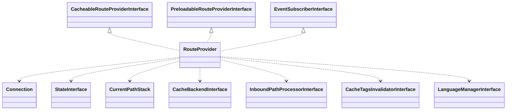

# Drupal - C4 Level 4: RouteProvider

**Generated:** 2025-10-15 06:19:40  
**Type:** Service  
**File:** `core/lib/Drupal/Core/Routing/RouteProvider.php`

---

## Component Overview

### Purpose
The RouteProvider manages route matching and URL generation in Drupal by retrieving and providing routes based on incoming requests, route names, or patterns. It serves as a front-end for Drupal-stored routes, enabling efficient navigation and API integration through caching and database queries.

### Responsibility
To provide access to routing information stored in the database, matching routes to requests while optimizing performance through caching and preloading mechanisms.

### Design Patterns
- Provider
- Cache
- Repository
- Event Subscriber

---

## Public Interface

```php
public getRouteCollectionForRequest(Symfony\Component\HttpFoundation\Request $request)
public getRouteByName(string $name)
public getRoutesByNames(array $names)
public getRoutesByPattern(string $pattern)
public getAllRoutes()
public reset()
public addExtraCacheKeyPart($cache_key_provider, $cache_key_part)
public getRouteAliases(string $route_name)
```

---

## Key Methods

### `getRouteCollectionForRequest()`

**Purpose:** Retrieves a collection of potential routes that match the given HTTP request, using caching to avoid redundant database queries.

**Parameters:** `Symfony\Component\HttpFoundation\Request $request`

**Returns:** `Symfony\Component\Routing\RouteCollection`

**Complexity:** Complex

### `getRouteByName()`

**Purpose:** Looks up and returns a single route by its name, handling aliases and throwing an exception if not found.

**Parameters:** `string $name`

**Returns:** `Symfony\Component\Routing\Route`

**Complexity:** Moderate

### `getRoutesByNames()`

**Purpose:** Preloads and retrieves multiple routes by their names from cache or database.

**Parameters:** `array $names`

**Returns:** `array`

**Complexity:** Moderate

### `getRoutesByPattern()`

**Purpose:** Fetches routes matching a given pattern by converting it to an outline and querying the database.

**Parameters:** `string $pattern`

**Returns:** `Symfony\Component\Routing\RouteCollection`

**Complexity:** Moderate

### `getRouteCollectionCacheId()`

**Purpose:** Generates a unique cache ID for route collections based on request details, language, and query parameters.

**Parameters:** `Symfony\Component\HttpFoundation\Request $request`

**Returns:** `string`

**Complexity:** Moderate

---

## Dependencies



**Dependency Details:**

- **CacheableRouteProviderInterface** (interface) - implements
- **PreloadableRouteProviderInterface** (interface) - implements
- **EventSubscriberInterface** (interface) - implements
- **Connection** (class) - injects
- **StateInterface** (class) - injects
- **CurrentPathStack** (class) - injects
- **CacheBackendInterface** (class) - injects
- **InboundPathProcessorInterface** (class) - injects
- **CacheTagsInvalidatorInterface** (class) - injects
- **LanguageManagerInterface** (class) - injects
- **Request** (class) - uses
- **RouteCollection** (class) - uses
- **Route** (class) - uses

---

## Internal State

- `connection: Drupal\Core\Database\Connection - The database connection for fetching routes.`
- `tableName: string - The name of the database table storing routes.`
- `state: Drupal\Core\State\StateInterface - Manages state data for routing masks.`
- `routes: array - Cached array of loaded routes keyed by name.`
- `serializedRoutes: array - Cached array of serialized routes for preloading.`
- `currentPath: Drupal\Core\Path\CurrentPathStack - Tracks the current path in requests.`
- `cache: Drupal\Core\Cache\CacheBackendInterface - Backend for caching route collections and loads.`
- `cacheTagInvalidator: Drupal\Core\Cache\CacheTagsInvalidatorInterface - Handles cache invalidation.`
- `pathProcessor: Drupal\Core\PathProcessor\InboundPathProcessorInterface - Processes inbound paths.`
- `languageManager: Drupal\Core\Language\LanguageManagerInterface - Manages language handling in routes.`
- `extraCacheKeyParts: array - Additional parts for cache key generation.`

---

## Key Algorithms

### Candidate Outlines Generation

Uses bit manipulation to generate potential route pattern outlines from path parts, querying state or generating ranges for short paths to narrow down matching routes efficiently.

### Route Sorting Comparison

Sorts routes by fit (highest first) and name (ascending) to prioritize better matches, avoiding SQL filesorts for consistent cross-backend performance.

### Cache ID Computation

Constructs unique cache IDs incorporating language, query parameters, and request path to ensure cache specificity and prevent conflicts.


---

## Integration Points

- Symfony Routing components for route objects and collections
- Database for persistent route storage
- Cache system for route and collection caching
- State system for menu masks
- Language manager for URL-based language detection
- Path processor for inbound path modifications
- Event dispatcher for route reloads and invalidations

---

## Architectural Notes

The RouteProvider relies heavily on caching to optimize route matching performance, using database queries as a fallback and invalidating caches on routing events. It incorporates multilingual support and parameter normalization to handle diverse request scenarios. The design follows a provider pattern with event subscription for dynamic cache management, ensuring scalability in a modular CMS architecture.

---

*Generated by Flowscribe - Automated C4 Architecture Documentation*
