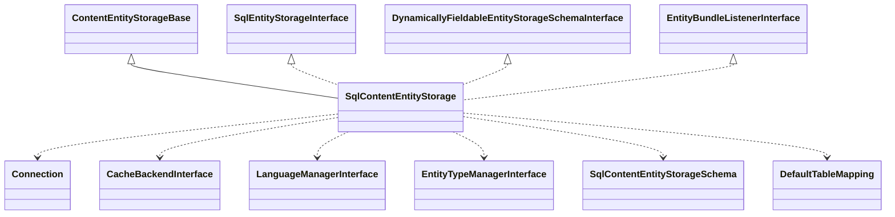

# Drupal - C4 Level 4: SqlContentEntityStorage

**Generated:** 2025-10-15 06:18:34  
**Type:** DAO  
**File:** `core/lib/Drupal/Core/Entity/Sql/SqlContentEntityStorage.php`

---

## Component Overview

### Purpose
Manages the persistence of content entities in SQL databases, providing an abstract database layer for storing, retrieving, and querying entity data while handling features like revisions and translations.

### Responsibility
Handling CRUD operations for content entities through SQL storage, ensuring data integrity, performance, and scalability across base, revision, data, and revision-data tables.

### Design Patterns
- Repository
- Factory
- Dependency Injection

---

## Public Interface

```php
public createInstance(ContainerInterface $container, EntityTypeInterface $entity_type)
public getBaseTable()
public getRevisionTable()
public getDataTable()
public getRevisionDataTable()
public getTableMapping(array $storage_definitions = NULL)
public save(EntityInterface $entity)
public delete(array $entities)
public restore(EntityInterface $entity)
```

---

## Key Methods

### `createInstance()`

**Purpose:** Creates an instance of the storage handler using dependency injection from the container.

**Parameters:** `ContainerInterface $container, EntityTypeInterface $entity_type`

**Returns:** `SqlContentEntityStorage`

**Complexity:** Simple

### `__construct()`

**Purpose:** Initializes the storage handler with dependencies and sets up table layout based on entity type.

**Parameters:** `EntityTypeInterface $entity_type, Connection $database, EntityFieldManagerInterface $entity_field_manager, CacheBackendInterface $cache, LanguageManagerInterface $language_manager, MemoryCacheInterface $memory_cache, EntityTypeBundleInfoInterface $entity_type_bundle_info, EntityTypeManagerInterface $entity_type_manager`

**Returns:** `void`

**Complexity:** Moderate

### `doLoadMultiple()`

**Purpose:** Loads multiple entities, attempting from cache first, then from storage, invoking hooks and setting cache.

**Parameters:** `array $ids or NULL`

**Returns:** `ContentEntityInterface[]`

**Complexity:** Moderate

### `mapFromStorageRecords()`

**Purpose:** Maps SQL query results to entity objects, attaching fields from base, revision, data, and dedicated tables.

**Parameters:** `array $records, bool $load_from_revision`

**Returns:** `EntityInterface[]`

**Complexity:** Complex

### `buildQuery()`

**Purpose:** Constructs a Select query for loading entities, handling joins for revisions and conditions.

**Parameters:** `array $ids or NULL, array $revision_ids or FALSE`

**Returns:** `SelectInterface`

**Complexity:** Complex

### `save()`

**Purpose:** Saves an entity, wrapping in a transaction and invoking parent save logic.

**Parameters:** `EntityInterface $entity`

**Returns:** `int (SAVED_NEW or SAVED_UPDATED)`

**Complexity:** Moderate

### `delete()`

**Purpose:** Deletes entities and their field data, using transactions for rollback.

**Parameters:** `EntityInterface[] $entities`

**Returns:** `void`

**Complexity:** Moderate

---

## Dependencies



**Dependency Details:**

- **ContentEntityStorageBase** (class) - extends
- **SqlEntityStorageInterface** (interface) - implements
- **DynamicallyFieldableEntityStorageSchemaInterface** (interface) - implements
- **EntityBundleListenerInterface** (interface) - implements
- **Connection** (interface) - injects
- **CacheBackendInterface** (interface) - injects
- **LanguageManagerInterface** (interface) - injects
- **EntityTypeManagerInterface** (interface) - injects
- **SqlContentEntityStorageSchema** (class) - creates
- **DefaultTableMapping** (class) - creates

---

## Internal State

- `fieldStorageDefinitions: FieldStorageDefinitionInterface[] - Array of field storage definitions for mapping fields to tables`
- `tableMapping: TableMappingInterface - Mapping of fields to SQL tables`
- `revisionKey: string - Name of revision key field if revisionable`
- `langcodeKey: string - Name of language code key if translatable`
- `baseTable: string - Main entity table name`
- `revisionTable: string - Revision table name if revisionable`
- `dataTable: string - Data table name if translatable`
- `revisionDataTable: string - Revision data table name if both revisionable and translatable`
- `database: Connection - Active database connection`
- `storageSchema: SqlContentEntityStorageSchema - Schema handler for database operations`
- `languageManager: LanguageManagerInterface - Manages language settings`
- `entityTypeManager: EntityTypeManagerInterface - Manages entity types`

---

## Key Algorithms

### Entity Loading and Mapping

Loads entities by building SQL queries across multiple tables (base, revision, data), maps records to entity objects with field attachments, handles revisions and translations, ensuring efficient data retrieval and integrity for complex entity structures.

### Query Building

Constructs dynamic SELECT queries with joins for revisions and conditions, using table mappings to prevent over-fetching fields, critical for performance in multi-table scalable storage.


---

## Integration Points

- Integrates with Drupal's Database Connection service for executing SQL queries
- Uses Cache services (persistent and memory) for entity caching to improve load performance
- Relies on Language Manager for multilingual support
- Communicates with Entity Type Manager for metadata and field definitions
- Interacts with Storage Schema classes for automatic table schema management

---

## Architectural Notes

This class employs a multi-table storage strategy to support entity features like revisions and translations, automatically generating schemas via injected schema handlers. It uses transactions for atomic operations to ensure data consistency, and follows a Repository pattern for abstracted CRUD over SQL, allowing extensibility for custom entity types while maintaining performance for large-scale content management.

---

*Generated by Flowscribe - Automated C4 Architecture Documentation*
