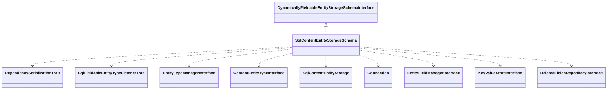

# Drupal - C4 Level 4: SqlContentEntityStorageSchema

**Generated:** 2025-10-15 06:18:50  
**Type:** Handler  
**File:** `core/lib/Drupal/Core/Entity/Sql/SqlContentEntityStorageSchema.php`

---

## Component Overview

### Purpose
Manages database schema definitions and updates for SQL-based entity storage in Drupal, ensuring consistency during entity type and field changes, including support for revisionable and translatable entities.

### Responsibility
Handles the creation, updating, and deletion of database schemas for content entities, facilitating safe migrations and schema consistency in a dynamic content management system.

### Design Patterns
- Strategy
- Factory
- Observer

---

## Public Interface

```php
public requiresEntityStorageSchemaChanges()
public requiresFieldStorageSchemaChanges()
public requiresEntityDataMigration()
public requiresFieldDataMigration()
public onEntityTypeCreate()
public onEntityTypeUpdate()
public onEntityTypeDelete()
public onFieldableEntityTypeCreate()
public onFieldableEntityTypeUpdate()
public onFieldStorageDefinitionCreate()
public onFieldStorageDefinitionUpdate()
public onFieldStorageDefinitionDelete()
```

---

## Key Methods

### `requiresEntityStorageSchemaChanges()`

**Purpose:** Determines if entity type schema changes are required by comparing new and original entity types, focusing on shared table structures and schema data.

**Parameters:** `EntityTypeInterface $entity_type, EntityTypeInterface $original`

**Returns:** `bool`

**Complexity:** Moderate

### `requiresFieldStorageSchemaChanges()`

**Purpose:** Checks if field storage schema updates are needed based on changes in field properties, custom storage, or schema definitions.

**Parameters:** `FieldStorageDefinitionInterface $storage_definition, FieldStorageDefinitionInterface $original`

**Returns:** `bool`

**Complexity:** Moderate

### `onEntityTypeCreate()`

**Purpose:** Creates the initial database schema for a new entity type, including tables and field storage.

**Parameters:** `EntityTypeInterface $entity_type`

**Returns:** `void`

**Complexity:** Complex

### `onEntityTypeUpdate()`

**Purpose:** Updates the entity type schema, handling indexes, keys, and ensuring changes are applied safely outside batch contexts.

**Parameters:** `EntityTypeInterface $entity_type, EntityTypeInterface $original`

**Returns:** `void`

**Complexity:** Complex

### `onEntityTypeDelete()`

**Purpose:** Drops all tables and deletes schema data associated with an entity type being removed.

**Parameters:** `EntityTypeInterface $entity_type`

**Returns:** `void`

**Complexity:** Moderate

### `onFieldStorageDefinitionCreate()`

**Purpose:** Creates schema for a new field storage definition, adding tables or columns as needed.

**Parameters:** `FieldStorageDefinitionInterface $storage_definition`

**Returns:** `void`

**Complexity:** Moderate

### `onFieldStorageDefinitionUpdate()`

**Purpose:** Updates schema for an existing field storage definition.

**Parameters:** `FieldStorageDefinitionInterface $storage_definition, FieldStorageDefinitionInterface $original`

**Returns:** `void`

**Complexity:** Complex

### `onFieldStorageDefinitionDelete()`

**Purpose:** Handles deletion of field storage schema, removing tables or columns if safe.

**Parameters:** `FieldStorageDefinitionInterface $storage_definition`

**Returns:** `void`

**Complexity:** Moderate

---

## Dependencies



**Dependency Details:**

- **DynamicallyFieldableEntityStorageSchemaInterface** (interface) - implements
- **DependencySerializationTrait** (trait) - uses
- **SqlFieldableEntityTypeListenerTrait** (trait) - uses
- **EntityTypeManagerInterface** (class) - injects
- **ContentEntityTypeInterface** (class) - injects
- **SqlContentEntityStorage** (class) - injects
- **Connection** (class) - injects
- **EntityFieldManagerInterface** (class) - injects
- **KeyValueStoreInterface** (interface) - injects
- **DeletedFieldsRepositoryInterface** (interface) - injects

---

## Internal State

- `$entityTypeManager: EntityTypeManagerInterface - Manages entity type definitions`
- `$entityFieldManager: EntityFieldManagerInterface - Handles field storage definitions`
- `$entityType: ContentEntityTypeInterface - The entity type this schema handles`
- `$fieldStorageDefinitions: FieldStorageDefinitionInterface[] - Active field storage definitions`
- `$storage: SqlContentEntityStorage - The SQL entity storage instance`
- `$database: Connection - Database connection for schema operations`
- `$schema: array - Static cache of generated schema arrays`
- `$installedStorageSchema: KeyValueStoreInterface - Tracks installed storage schemas`
- `$updateBackupRepository: KeyValueStoreInterface - Stores entity update backups`
- `$deletedFieldsRepository: DeletedFieldsRepositoryInterface - Manages deleted field repositories`

---

## Key Algorithms

### Schema Change Detection

Compares entity or field definitions to detect changes in schema requirements, such as table structures or indexes, ensuring updates are only applied when necessary for performance.

### Batch Entity Type Update Process

Manages complex updates with temporary and backup tables to prevent data loss; creates temporary schemas, copies data, renames tables atomically, and retains backups for rollback if configured.


---

## Integration Points

- Database schema operations via Connection interface
- Entity type and field management through EntityTypeManagerInterface and EntityFieldManagerInterface
- Key-value storage for persisting schema and backup data
- Deleted fields repository for handling removed fields
- SqlContentEntityStorage for entity data operations and table mappings

---

## Architectural Notes

This class employs traits for shared listener behavior, ensuring reusability across entity schema handlers, and implements a strategy pattern for dynamic field handling via its interface. It prioritizes safe migrations using batch processes with backup mechanisms to handle revisionable and translatable entities, constraining updates to batch contexts for complex changes. The design separates schema logic from data operations, integrating tightly with Drupal's dependency injection and configuration systems.

---

*Generated by Flowscribe - Automated C4 Architecture Documentation*
