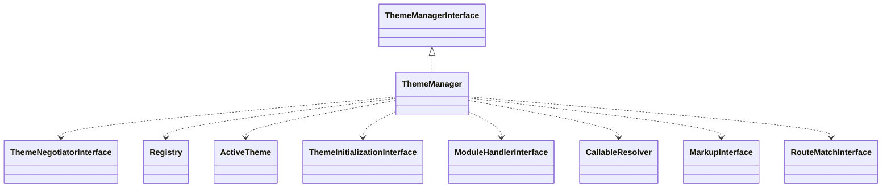

# Drupal - C4 Level 4: ThemeManager

**Generated:** 2025-10-15 06:20:29  
**Type:** Service  
**File:** `core/lib/Drupal/Core/Theme/ThemeManager.php`

---

## Component Overview

### Purpose
Manages theme rendering and template logic for content display in Drupal, ensuring consistent user experience by integrating with rendering pipelines, entities, and caching systems.

### Responsibility
Orchestrating the resolution, preprocessing, and rendering of theme hooks and templates to display content appropriately based on active themes.

### Design Patterns
- Strategy
- Registry

---

## Public Interface

```php
public getActiveTheme(?RouteMatchInterface $route_match = NULL): ActiveTheme
public hasActiveTheme(): bool
public resetActiveTheme(): ThemeManagerInterface
public setActiveTheme(ActiveTheme $active_theme): ThemeManagerInterface
public render(string|array $hook, array $variables): string|false
public alterForTheme(ActiveTheme $theme, string|array $type, mixed &$data, mixed &$context1 = NULL, mixed &$context2 = NULL): void
public alter(string|array $type, mixed &$data, mixed &$context1 = NULL, mixed &$context2 = NULL): void
```

---

## Key Methods

### `getActiveTheme()`

**Purpose:** Retrieves the currently active theme, initializing it if necessary.

**Parameters:** `?RouteMatchInterface $route_match = NULL`

**Returns:** `ActiveTheme`

**Complexity:** Moderate

### `render()`

**Purpose:** Renders a theme hook by resolving implementations, preprocessing variables, and generating output using templates.

**Parameters:** `string|array $hook, array $variables`

**Returns:** `string|false`

**Complexity:** Complex

### `alter()`

**Purpose:** Applies theme-specific alter hooks to data for customization.

**Parameters:** `string|array $type, mixed &$data, mixed &$context1 = NULL, mixed &$context2 = NULL`

**Returns:** `void`

**Complexity:** Moderate

### `buildThemeHookSuggestions()`

**Purpose:** Builds an array of suggested theme hooks for fallback resolution.

**Parameters:** `string $hook, string $info_base_hook, array &$variables`

**Returns:** `string[]`

**Complexity:** Moderate

---

## Dependencies



**Dependency Details:**

- **ThemeManagerInterface** (interface) - implements
- **ThemeNegotiatorInterface** (interface) - injects
- **Registry** (class) - uses
- **ActiveTheme** (class) - uses
- **ThemeInitializationInterface** (interface) - injects
- **ModuleHandlerInterface** (interface) - injects
- **CallableResolver** (class) - injects
- **MarkupInterface** (interface) - uses
- **RouteMatchInterface** (interface) - uses

---

## Internal State

- `themeNegotiator: ThemeNegotiatorInterface - Negotiates the active theme based on route.`
- `themeRegistry: Registry - Stores theme implementations and preprocessors.`
- `activeTheme: ActiveTheme - Holds the currently active theme object.`
- `themeInitialization: ThemeInitializationInterface - Initializes theme resources.`
- `moduleHandler: ModuleHandlerInterface - Handles module-related operations like invoking hooks.`
- `root: string - The application root directory.`
- `defaultVariables: array|null - Caches default template variables.`

---

## Key Algorithms

### Theme Hook Resolution and Fallback

Resolves theme hooks by checking for implementations, stripping suffixes for fallbacks, and applying suggestions to find the most specific template, ensuring flexible and extensible theming.

### Variable Preprocessing Pipeline

Invokes a series of preprocess functions and alters for theme variables, including global, initial, and themed-specific callbacks, to build a complete variable set before rendering.


---

## Integration Points

- ThemeNegotiator for determining active themes based on routes.
- ThemeRegistry for accessing theme implementations and preprocessors.
- ModuleHandler for invoking module-based hooks and alters on themes.
- Renderer service for attaching bubbleable metadata like assets and cache info.

---

## Architectural Notes

ThemeManager serves as a central service in Drupal's theming system, leveraging dependency injection for extensibility through strategies like negotiators and registries. It employs hooks for modularity, allowing modules and themes to alter rendering behavior without modifying core logic. Caching of default variables and lazy initialization of active themes optimize performance in high-traffic CMS environments.

---

*Generated by Flowscribe - Automated C4 Architecture Documentation*
